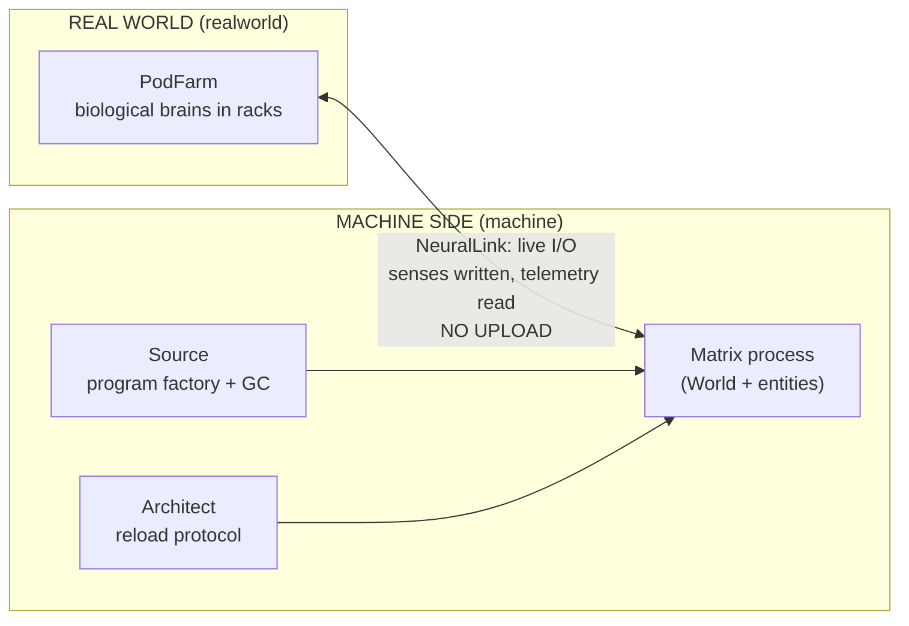

# matrix-sim

> Running The Matrix on the JVM — the backend of it. There is no frontend, and there is no spoon.

A tick-based, **deterministic**, **headless** simulation daemon. Humans exist in the real world as brains lying in pods; inside the Matrix they are avatars only (the mind is never uploaded — that is this repo's core architectural thesis). On the machine side: the Source, the Architect and the agents; in program society: the Oracle, the exiles and the invisible workers. The film arc plays itself:

**anomaly builds up → The One is born → Smith refuses GC → overflow → negotiation → reboot**

We are not building a game or a visualization. We are building the Matrix's backend: the world state, the process ecosystem, the connection protocol, the ops plane. The system is observed the way operators observe systems — through logs, metrics and state digests (D-020) — and its only *true* output is the sensory stream fed to each connected brain (D-021). See the **Vision** section in [docs/ARCHITECTURE.md](docs/ARCHITECTURE.md).

## Released phases

| Release | Phase | The arc it shipped |
|---|---|---|
| `v1.0.0` | **The Matrix** | The city wakes: 200 minds in pods, agents on patrol, red pills dropping off the cluster; death crosses the NeuralLink bridge, and two boxes (Apple-Silicon macOS, x86-64 Linux) produce the same universe byte for byte. |
| `v2.0.0` | **Reloaded** | Program society: the Source offers deletion with grace, one program refuses (`I DIDN'T`), and the infection Decorator begins eating the city. |
| `v2.5.0` | **The Animatrix** | The rendered ecosystem: 12 species, 660+ entities, fixed-point flocks over the spatial hash; blue pills commute; a healthy program is invisible. |

Each release's notes carry its lock report — the evidence produced at cut time. The finale (`v3.0.0`, **Revolutions**: the ledger, The One, the overflow, the treaty, the reboot) cuts when its verification round returns green.

## Architecture at a glance



## Quickstart

Requires **JDK 17+**. On macOS with an older default JDK:

```bash
brew install openjdk@17
sudo ln -sfn $(brew --prefix)/opt/openjdk@17/libexec/openjdk.jdk /Library/Java/JavaVirtualMachines/openjdk-17.jdk
export JAVA_HOME=$(/usr/libexec/java_home -v 17) && export PATH="$JAVA_HOME/bin:$PATH"
```

Build and run:

```bash
javac -encoding UTF-8 --release 17 -d out $(find src -name '*.java')
java -cp out matrix.Main --selftest                          # fast gate: digest double-run at 2,000 ticks
java -cp out matrix.Main --selftest --ticks 6000             # the finale gate: 60-link chain, birth to second birth
java -cp out matrix.Main --bench                             # the D-027 budget table, exit code = verdict
java -cp out matrix.Main                                     # live daemon + ops console on stdin
java -cp out matrix.Main --headless --ticks 6000 --seed 42   # the whole film, deterministically
java -cp out matrix.Main --follow "Thomas A." --headless --ticks 6000 | grep '^{' | jq .   # the One's dream (D-021)
```

What the 6,000-tick run plays, in order (seed 42): **The One is born** (t=1289, for a debt of 30,227) → Smith's `I DIDN'T` (1525) → **SMITH OVERFLOW** and Neo's flatline at Machine City (4284) → `"Peace."` (4304) → the treaty — 417 originals restored in one flush, six sleepers walk out the open door, **REBOOT v7.0** (4324) → and at 5249, a second Thomas A. Anderson, because the ledger never stopped counting.

A followed dream has two possible endings, and the stream tells them apart: `"ended — they walked out the open door"` (liberation) vs `"lost — the dream is no longer theirs"` (death — or a mind currently worn by Smith). One pilot's stream went dark twice and came back in between; the investigation that explained her is the field manual's case study in [docs/ARCHITECTURE.md](docs/ARCHITECTURE.md) (*the case of Nadia Petrov*).

Ops console commands (an admin plane, not a UI — D-007/D-019): `red` · `agent` · `smith` · `deja` · `reload` · `pause` · `speed N` · `quit`

Observability contract (D-020): append-only event log, `METRIC` lines every 100 ticks, and a `DIGEST` chain — a canonical hash of world state. Two runs with the same seed produce identical digest chains; a diff pinpoints the tick where reality diverged. Same seed, same fate, on every platform: a seed-42 run produces byte-identical digests on Apple-Silicon macOS and x86-64 Linux (verified 2026-08-10).

## Repo map

```
README.md            ← you are here
ROADMAP.md           ← where we're going, in what order, decision gates
PRINCIPLES.md        ← the why: architectural + development principles, and The Door
docs/ARCHITECTURE.md ← vision + UML: class, sequence, state (mermaid)
docs/DECISIONS.md    ← decision index: one row per decision
docs/adr/            ← one ADR record per decision (D-029)
CLAUDE.md            ← auto-loaded pointer for AI sessions (a door, not a document)
src/matrix/          ← core · realworld · machine · entities
probes/              ← the skeptic's bench: read-only diagnostic instruments (D-030)
tools/               ← process jigs: the release cutter and kin (never daemon code)
```

Documentation policy: **no documents beyond these five .md files.** No doc piles; new information either goes into one of the five, or it doesn't go in. (`CLAUDE.md` is machine-loading infrastructure, like `.gitignore` — it carries pointers, never content.)

## Process — everything runs like the Matrix

- **main = the Source.** Everything that becomes code is born there and returns there. Nothing merges without evidence.
- **Roles are law (D-037):** the owner is the Architect — theory, decisions, story. The resident machine is the Oracle — all of practice. Trust is engineered, not assumed: merges happen behind five locks — green evidence · digest leash · executed ADR Confirmations · an independent adversarial skeptic pass · a prose theory brief.
- **Decisions gate code (D-000):** every consequential choice is a MADR record with a status light (🟢 law · 🟡 open · 🔵 parked); a 🟡 record never merges into code undiscussed, and season gates close only by the Architect's verdict in their thread.
- **Delivery is unit PRs (D-039):** one build-unit issue = one small PR that closes it, atomic commits carrying finding + fix + evidence, light locks per PR (compile · `--selftest` · digest), the full skeptic pass at phase boundaries.
- **Determinism is law (D-010):** same seed → same film, byte for byte, across operating systems and CPU architectures. Every phase's definition of done is a single machine-verifiable command, and `--bench` measures the speed promises (D-027).
- **Déjà vu = hotfix.** If a patch lands on main, the changelog gets a "black cat" note — and since v3, the anomaly ledger notices.
- **Ours alone (see [LICENSE](LICENSE)):** this is a proprietary showcase and an unofficial, non-commercial fan work — the code is the exhibit, not the handout. All rights reserved; no film assets anywhere; no affiliation with Warner Bros.
