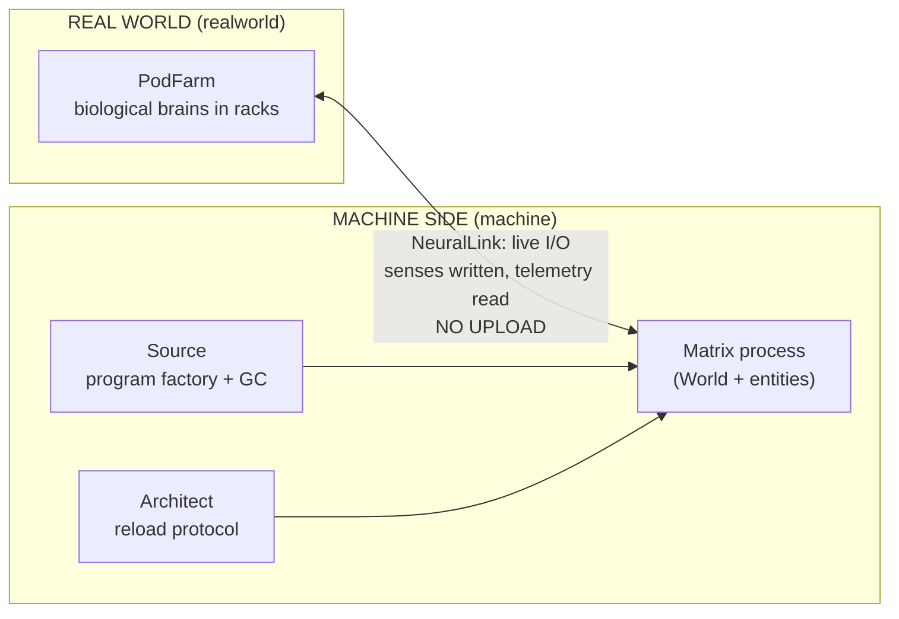

# matrix-sim

> Running The Matrix on the JVM. An OOP-modeled ecosystem simulation — pods, programs, agents, Smith and The One cycle. There is no spoon.

A tick-based, **deterministic** simulation that runs in the terminal. Humans exist in the real world as brains lying in pods; inside the Matrix they are avatars only (the mind is never uploaded — that is this repo's core architectural thesis). On the machine side: the Source, the Architect and the agents; in program society: the Oracle, the exiles and the invisible workers. The film arc plays itself:

**anomaly builds up → The One is born → Smith refuses GC → overflow → negotiation → reboot**

## Architecture at a glance



For the detailed UML (class / sequence / state): **[docs/ARCHITECTURE.md](docs/ARCHITECTURE.md)**

## Quickstart

> ⚠️ The engine becomes runnable in **v1.0** — see the [ROADMAP](ROADMAP.md). The target interface is already fixed:

```bash
javac -encoding UTF-8 -d out $(find src -name '*.java')
java -cp out matrix.Main                      # live terminal mode
java -cp out matrix.Main --headless --ticks 6000 --seed 42   # deterministic replay
```

Stdin commands in live mode: `red` · `agent` · `smith` · `deja` · `reload` · `pause` · `speed N` · `quit`

## Repo map

```
README.md            ← you are here
ROADMAP.md           ← where we're going, in what order, decision gates
docs/ARCHITECTURE.md ← UML: class, sequence, state (mermaid)
docs/DECISIONS.md    ← design decisions, ADR-lite (single table)
src/matrix/          ← core · realworld · machine · entities · sim
```

Documentation policy: **no documents beyond these four .md files.** No doc piles; new information either goes into one of the four, or it doesn't go in.

## Process — everything runs like the Matrix

- **main = the Source.** Everything that becomes code is born there and returns there. Nothing merges without review.
- **Every phase is born as a draft PR**, reviewed together, merged with evidence (one commit per finding, one-line proof).
- **Determinism is law:** same seed → same film. Every phase's definition of done is a single machine-verifiable command.
- **Déjà vu = hotfix.** If a patch lands on main, the changelog gets a "black cat" note.
