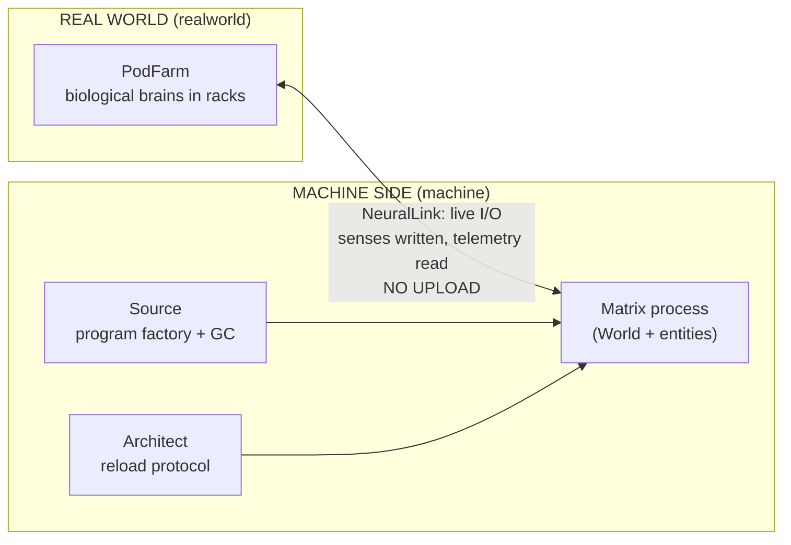

# matrix-sim

> Running The Matrix on the JVM — the backend of it. There is no frontend, and there is no spoon.

A tick-based, **deterministic**, **headless** simulation daemon. Humans exist in the real world as brains lying in pods; inside the Matrix they are avatars only (the mind is never uploaded — that is this repo's core architectural thesis). On the machine side: the Source, the Architect and the agents; in program society: the Oracle, the exiles and the invisible workers. The film arc plays itself:

**anomaly builds up → The One is born → Smith refuses GC → overflow → negotiation → reboot**

We are not building a game or a visualization. We are building the Matrix's backend: the world state, the process ecosystem, the connection protocol, the ops plane. The system is observed the way operators observe systems — through logs, metrics and state digests (D-020) — and its only *true* output is the sensory stream fed to each connected brain (D-021). See the **Vision** section in [docs/ARCHITECTURE.md](docs/ARCHITECTURE.md).

## Architecture at a glance



## Quickstart

Requires **JDK 17+**. On macOS with an older default JDK:

```bash
brew install openjdk@17
sudo ln -sfn $(brew --prefix)/opt/openjdk@17/libexec/openjdk.jdk /Library/Java/JavaVirtualMachines/openjdk-17.jdk
export JAVA_HOME=$(/usr/libexec/java_home -v 17) && export PATH="$JAVA_HOME/bin:$PATH"
```

Build and run (v1.0 lives on the phase branch until its PR merges):

```bash
javac -encoding UTF-8 --release 17 -d out $(find src -name '*.java')
java -cp out matrix.Main --selftest                          # in-process digest double-run (D-009)
java -cp out matrix.Main                                     # live daemon + ops console on stdin
java -cp out matrix.Main --headless --ticks 2000 --seed 42   # deterministic run + PERF line
java -cp out matrix.Main --follow anderson --headless --ticks 2000 | grep '^{' | jq .   # one pilot's dream (D-021)
```

Ops console commands (an admin plane, not a UI — D-007/D-019): `red` · `agent` · `pause` · `speed N` · `quit` (v2.0 adds `smith`, `deja`; v3.0 adds `reload`)

Observability contract (D-020): append-only event log, `METRIC` lines every 100 ticks, and a `DIGEST` chain — a canonical hash of world state. Two runs with the same seed produce identical digest chains; a diff pinpoints the tick where reality diverged. Same seed, same fate, on every platform: a seed-42 run produces byte-identical digests on Apple-Silicon macOS and x86-64 Linux (verified 2026-08-10).

## Repo map

```
README.md            ← you are here
ROADMAP.md           ← where we're going, in what order, decision gates
PRINCIPLES.md        ← the why: architectural + development principles, and The Door
docs/ARCHITECTURE.md ← vision + UML: class, sequence, state (mermaid)
docs/DECISIONS.md    ← decision index: one row per decision
docs/adr/            ← one ADR record per decision (D-029)
CLAUDE.md            ← auto-loaded pointer for AI sessions (a door, not a document)
src/matrix/          ← core · realworld · machine · entities
```

Documentation policy: **no documents beyond these five .md files.** No doc piles; new information either goes into one of the five, or it doesn't go in. (`CLAUDE.md` is machine-loading infrastructure, like `.gitignore` — it carries pointers, never content.)

## Process — everything runs like the Matrix

- **main = the Source.** Everything that becomes code is born there and returns there. Nothing merges without review.
- **Every phase is born as a draft PR**, reviewed together, merged with evidence (one commit per finding, one-line proof).
- **Determinism is law:** same seed → same film. Every phase's definition of done is a single machine-verifiable command.
- **Déjà vu = hotfix.** If a patch lands on main, the changelog gets a "black cat" note.
