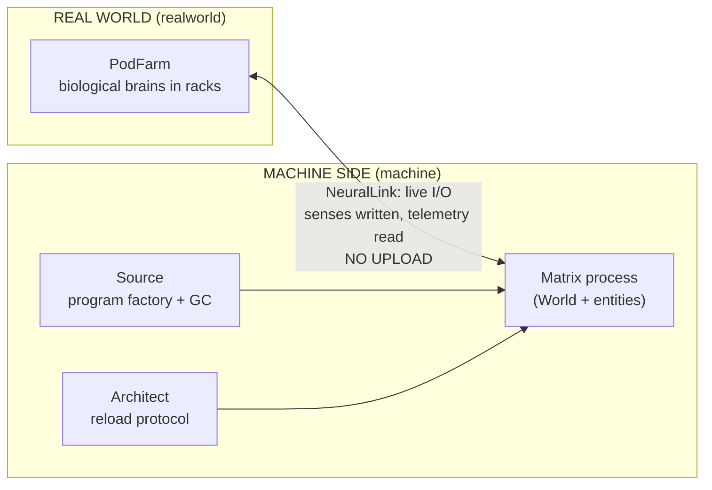

# matrix-sim

> Running The Matrix on the JVM — the backend of it. There is no frontend, and there is no spoon.

A tick-based, **deterministic**, **headless** simulation daemon. Humans exist in the real world as brains lying in pods; inside the Matrix they are avatars only (the mind is never uploaded — that is this repo's core architectural thesis). On the machine side: the Source, the Architect and the agents; in program society: the Oracle, the exiles and the invisible workers. The film arc plays itself:

**anomaly builds up → The One is born → Smith refuses GC → overflow → negotiation → reboot**

We are not building a game or a visualization. We are building the Matrix's backend: the world state, the process ecosystem, the connection protocol, the ops plane. The system is observed the way operators observe systems — through logs, metrics and state digests (D-020) — and its only *true* output is the sensory stream fed to each connected brain (D-021). See the **Vision** section in [docs/ARCHITECTURE.md](docs/ARCHITECTURE.md).

## Released phases

| Release | Phase | The arc it shipped |
|---|---|---|
| `v1.0.0` | **The Matrix** | The city wakes: 196 minds in pods (192 blue, 4 red), agents on patrol, red pills dropping off the cluster; death crosses the NeuralLink bridge, and two boxes (Apple-Silicon macOS, x86-64 Linux) produce the same universe byte for byte. |
| `v2.0.0` | **Reloaded** | Program society: the Source offers deletion with grace, one program refuses (`I DIDN'T`), and the infection Decorator begins eating the city. |
| `v2.5.0` | **The Animatrix** | The rendered ecosystem: 12 species, 660+ entities, fixed-point flocks over the spatial hash; blue pills commute; a healthy program is invisible. |
| `v3.0.0` | **Revolutions** | Season One's finale: the ledger owes the world an anomaly, The One is born for a debt, Smith overflows, Neo's body does not survive Machine City — treaty, open door, reboot, and a second Thomas because the cycle is the point. Two adversarial rounds signed it off. |

Each release's notes carry its lock report — the evidence produced at cut time. Season One is complete (D-036's line crossed 2026-08-11); the seasons beyond it are gated in [ROADMAP.md](ROADMAP.md).

## Architecture at a glance



## How the world works

**A tick is four steps, always in this order.** The spatial index freezes every
entity's position — that snapshot is what everyone *perceives*, so a mind that
dies this tick can still be seen alive, because the news has not reached you yet.
Then every living entity decides, reading the frozen world. Decisions do not take
effect: they queue as events. At the end of the tick the queue flushes in order,
and only then has anything happened (D-005). Nothing in this world mutates while
something else is looking at it.

**The One is arithmetic, not a script.** Every ten ticks each open link pays
*residue* into one uncapped counter — the anomaly ledger — priced by how much the
mind resists the dream:

| source | per window | what it is |
|---|---|---|
| a blue pill | `1` | the ordinary friction of a life that is not real |
| a red pill | `8` | someone who knows |
| déjà vu | `250` | a parked region re-materialising: cache invalidation, made visible |
| the Kid | `24` | one mind's personal breaking point, derived from its name — no dice at all |

When the balance crosses `LEDGER_BOUND = 30_000`, the very next tick births The
One. Nobody wrote *"Neo appears at 1299"* — the counter reached a number and the
world answered. Seed 42, at HEAD:

```sh
java -cp out matrix.Main --headless --ticks 6000 --seed 42 | grep -E 'One is born|I DIDN|OVERFLOW|Peace|REBOOT|open door'
# [001299] FATE  The One is born — Thomas A. Anderson, grown for a debt of 30107 (the ledger does not forgive; it balances)
# [001525] BAD   Smith: "I knew what I was supposed to do. I DIDN'T."
# [004035] BAD   SMITH OVERFLOW — 62% assimilated; the old playbook is impossible
# [004055] FATE  The One: "Peace."
# [004075] FATE  REBOOT v7.0 — peace protocol active, the door stays open
# [004075] OK    open door tally: 6 walked out; the census keeps them
```

The debt is 30,107 rather than 30,000 because accrual runs every ten ticks and the
check fires the tick after the crossing. The overshoot is the ledger's, not a
tuning constant — and the arc's timing is emergent: nothing anywhere states when
Smith overflows.

**Deletion is a protocol, and the trilogy is one assumption collapsing.** The
Source does not delete a program; it *offers* deletion. SIGTERM, then
`GRACE_TICKS = 25` to comply, then collection. Three answers exist:

- an ordinary program dies — `GC: "purpose" returned to the Source, deleted`
- an exile **hides** — teleports somewhere else and the log says *swallowed the
  SIGTERM, gone to ground*
- agent Smith **refuses** — throws `DeletionRefusedException`, and the immune
  system becomes autoimmune

The assumption `processes accept SIGTERM` is recorded in the code on purpose, with
the note that it will age badly. Everything after v2.0 is that line failing.

**Reality is lazy.** Regions nobody is looking at fold into statistics and stop
thinking; when attention returns they re-materialise — same crowd, different
faces — and the world pays 250 residue for the seam (D-024). Déjà vu is not a
metaphor here. It is a cache miss with a price.

**The seal is the referee.** Every 100 ticks the whole world is hashed into a
chain: tick, the RNG's *draw count*, every entity's state, the ledger, the links.
Same seed, same film, byte for byte — and the draw count is in the hash, so a die
rolled and thrown away still moves the seal. That is what makes every claim in
this repository falsifiable by one command:

```sh
java -cp out matrix.Main --headless --ticks 6000 --seed 42 | grep '^DIGEST tick=6000'
# DIGEST tick=6000 sha=be383798973dfe15006edaf96884e2ea4472e22142ada7518fc85d6f60cfa969
```

That value is pinned in [`.github/canonical-digest`](.github/canonical-digest)
with the argument for the last time it moved. It is the only thing in the project
that cannot be argued with.

## What it does not do

The naked version, because a reader deserves the gaps as plainly as the features.
Every line here is a live measurement, not a caveat.

**A program's purpose is a name, not a lifecycle.** `Program.purpose` is a
`final String`, and the only thing that reads it besides log lines is the orphan
registry, which uses it as a key — an identity, never a condition. Nothing asks
whether a purpose has been *served*. Collection fires on a cadence and picks at
random — `t % EXILE_COLLECT_EVERY_TICKS == 0`, then `collectRandomExile()`.
**No program is ever deleted because its work is done**,
which is a strange thing to say about citizens D-025 calls purpose-bound. A
traffic light never finishes; the Keymaker's whole existence is one door. Today
they share one lifecycle and it is a timer.

**The city runs out of people.** `BLUE_START = 192` plus `RED_START = 4` is every
mind the world will ever hold. Deaths, awakenings and the open door are all
withdrawals; nothing is ever grown. At seed 42 `blue=0` first prints at tick
**51,400** and never recovers (#927). The machines' one line about a fresh crop
inbound is printed by `Architect.reload` and delivered by nothing.

**The world does not grow with the dial.** `--scale` multiplies population and
leaves the map at 3,200 fixed buckets, so the neighbour query degrades from an
index into a scan as the city fills. Measured across two doublings, the per-tick
cost exponent climbs **1.46 → 1.86** (#1023) — and `ECO_SCALE_MAX = 100` refuses
the ladder at 46,208 entities, 21.6x below the 1,000,000 the roadmap names. The
cap is load-bearing, not timid (#1028).

**One seed is the whole guarantee.** The canonical seal watches seed 42 alone.
That proves *determinism* perfectly and proves a *property* not at all — three
defects this week were green at 42 and wrong elsewhere: a tolerance twenty times
the drift it was hiding (#1002), a median that never settled (#979), and a ledger
that disagrees with its own mirror on seven of the first sixty universes (#1090).
#1094 asks for the rule that separates the two kinds of row.

**And you cannot play it.** There is an ops console and a per-mind perception feed
(`--follow NAME`), but no path by which a human decides what one avatar does on a
given tick. The Merovingian is in there — he wanders, and he swallows SIGTERMs —
and there is nothing to say to him: the favor economy that would let a program buy
shelter is an accepted decision with no code (D-053), as is the allegiance ledger
behind it (D-051).

## Quickstart

Requires **JDK 17+**. On macOS with an older default JDK:

```bash
brew install openjdk@17
sudo ln -sfn $(brew --prefix)/opt/openjdk@17/libexec/openjdk.jdk /Library/Java/JavaVirtualMachines/openjdk-17.jdk
export JAVA_HOME=$(/usr/libexec/java_home -v 17) && export PATH="$JAVA_HOME/bin:$PATH"
```

Build and run:

```bash
javac -encoding UTF-8 --release 17 -d out $(find src -name '*.java')
java -cp out matrix.Main --selftest                          # fast gate: digest double-run at 2,000 ticks
java -cp out matrix.Main --selftest --ticks 6000             # the finale gate: 60-link chain, birth to second birth
java -cp out matrix.Main --bench                             # the D-027 budget table, exit code = verdict
java -cp out matrix.Main                                     # live daemon + ops console on stdin
java -cp out matrix.Main --headless --ticks 6000 --seed 42   # the whole film, deterministically
java -cp out matrix.Main --follow "Thomas A." --headless --ticks 6000 | grep '^{' | jq .   # the One's dream (D-021)
```

**Chronos — record, fold, verdict (D-023).** A universe is its genesis plus its inputs; everything else is replay. `--chronos` records (live runs only), `--replay` folds a recording back into the same film, `--expect` makes that a machine verdict, `--audit` verdicts a recording without booting a universe at all, and `--snapshot-at` proves a retained digest walk agrees with the chain:

```bash
java -cp out matrix.Main --chronos rec.jsonl                        # stage 1: the live daemon records genesis + console inputs; `quit` ends it
java -cp out matrix.Main --replay rec.jsonl > rec.chain             # stage 2: fold it — the chain, in ChainDump format
java -cp out matrix.Main --replay rec.jsonl --expect rec.chain      # verify: REPLAY OK | FAIL — exit 0 match / 1 divergence / 2 refused
java -cp out matrix.Main --audit rec.jsonl                          # stage 5 slice: consistency without booting a universe
java -cp out matrix.Main --headless --ticks 600 --snapshot-at 500   # stage 3: SNAPSHOT tick/sha/bytes + SNAPSHOT_MATCHES_DIGEST
```

`--ticks` is a budget for **headless and selftest** runs only; a live daemon runs until the console says `quit`, so a recording is as long as you let it be. `--replay` honors `--ticks` on its own (default 2,000), and `--expect` overrides it with the dump's last tick.

```
REPLAY OK seed=42 ticks=2000 links=20 commands_applied=0 births_folded=0
AUDIT genesis seed=42 version=6 config=match
AUDIT OK records=2 seals_paired=0
SNAPSHOT tick=500 sha=e942d744ba8e4722068f667a50e3567421c592677c702b8b2f743f77ea009334 bytes=31024
SNAPSHOT_MATCHES_DIGEST=true
```

Measured on `main` at `1e0e236`, seed 42 — the default when `--seed` is absent. The `SNAPSHOT` sha and its byte count are a pin on the digest walk, so every declared digest move rewrites them — and they stopped being hand-checked numbers with #967: the pair lives in `.github/canonical-snapshot`, and the litany runs this command on every push, refusing a moved pin and a `SNAPSHOT_MATCHES_DIGEST=false` verdict alike. A move that forgets this block is red before the merge button, which is the only form of doc truth that survives the next crew.

**Scenario flags** fire a console command inside a headless run, so a scenario is reproducible without a human at the keyboard — `--sink-at T` scuttles the active ship in tick *T*'s zion slot (#119), `--sink-every N` files that same order every *N* ticks (#905), `--reload-at T` fires the Architect's reload right before tick *T* (#128; with `--chronos` the epoch seals onto the record first, written before the purge). The fleet only exists to be sunk after it launches:

Tick 0 is a real reload boundary: it means after boot and before the first tick. A requested reload must survive both the recording and the fold; this figure is the positive expectation that prevents a command-free run from standing in for the scenario:

```bash
java -cp out matrix.Main --headless --ticks 100 --reload-at 0 --chronos /tmp/matrix-reload-0.jsonl >/dev/null
java -cp out matrix.Main --replay /tmp/matrix-reload-0.jsonl --ticks 100 > /tmp/matrix-reload-0.chain
java -cp out matrix.Main --replay /tmp/matrix-reload-0.jsonl --expect /tmp/matrix-reload-0.chain | grep '^REPLAY OK'
# REPLAY OK seed=42 ticks=100 links=1 commands_applied=1 births_folded=0 seals_verified=1
```
```bash
java -cp out matrix.Main --headless --ticks 4500 --seed 42 --sink-at 4400
# [004076] FATE  the first hull: the Nebuchadnezzar joins the fleet — the census learns to fly
# [004400] FATE  the Nebuchadnezzar goes down — 3 wires cut, 0 souls lost with the hull
```
<!-- figure: java -cp out matrix.Main --headless --ticks 100 --reload-at 0 --chronos /tmp/matrix-reload-0.jsonl >/dev/null && java -cp out matrix.Main --replay /tmp/matrix-reload-0.jsonl --ticks 100 > /tmp/matrix-reload-0.chain && java -cp out matrix.Main --replay /tmp/matrix-reload-0.jsonl --expect /tmp/matrix-reload-0.chain | grep -qxF 'REPLAY OK seed=42 ticks=100 links=1 commands_applied=1 births_folded=0 seals_verified=1' && java -cp out matrix.Main --headless --ticks 4500 --seed 42 --sink-at 4400 2>/dev/null | grep 'goes down' == [004400] FATE  the Nebuchadnezzar goes down — 3 wires cut, 0 souls lost with the hull -->

One tick number cannot state a scenario that needs three losses to reach. `--sink-every N` can, and it is the only way to run the city past the end of its roster (#806): the fourth keel re-issues the first name under a generation mark.

```bash
java -cp out matrix.Main --headless --ticks 20000 --seed 42 --sink-every 500
# [009660] FATE  hull number 3: the Hammer joins the fleet — the census replaces what it lost
# [011150] FATE  hull number 4: the Nebuchadnezzar II joins the fleet — the census replaces what it lost
# [014130] FATE  hull number 5: the Logos II joins the fleet — the census replaces what it lost
```
<!-- figure: java -cp out matrix.Main --headless --ticks 20000 --seed 42 --sink-every 500 2>/dev/null | grep 'hull number 5' == [014130] FATE  hull number 5: the Logos II joins the fleet — the census replaces what it lost -->

**`--scale N`** is the homecoming dial (#136): it multiplies every Bestiary population while humans, agents, exiles and the arc keep canon counts. `--scale 11` is the ~5,269-entity world D-027's retargeted budget row is measured at. Live runs only — it is refused with `--chronos`/`--replay` (exit 2), because a genesis line carries no scale, and scale 1 is the canonical world byte-for-byte.

```bash
java -cp out matrix.Main --headless --ticks 200 --seed 42 --scale 11
# METRIC tick=200 blue=191 red=5 agents=6 total=5269 infected=0.000 anomaly=4522.0 selfsub=0
```

`java -cp out matrix.Main --help` prints the full flag list; it is the surface of record, and this section is checked against it.

What the 6,000-tick run plays, in order (seed 42) — **two truthful answers, pick your checkout**:

- **As of the `v3.0.0` tag** (the sealed Season One film): **The One is born** (t=1289, debt 30,227) → `I DIDN'T` (1525) → **SMITH OVERFLOW** + Neo's flatline at Machine City (4284) → `"Peace."` (4304) → treaty, six walk free, **REBOOT v7.0** (4324) → a second Thomas at 5249.
- **On `main` at `57bbf96`** (Season Two's world — LOD, substrate, the fleet, the audit): birth **1299** (debt 30,107) → `I DIDN'T` (1525) → overflow + flatline **4035** → `"Peace."` (4055) → reboot + the door **4075** → the second Thomas at **4989**. Measured, not remembered: `java -cp out:probes/out ArcBeats 6000`.

*Black cat note:* the drift between those two columns is not nondeterminism — every Season Two mechanic that shifted the world's dynamics declared its digest move in its own PR, and each checkout replays ITS film byte-for-byte, forever. Same seed, same fate, on every platform: seed-42 digests verified byte-identical across **Apple-Silicon macOS, x86-64 Debian, and an x86-64 Ubuntu container** (third platform 2026-08-11, against the `v3.0.0` tag and current main both).

A followed dream has two possible endings, and the stream tells them apart: `"ended — they walked out the open door"` (liberation) vs `"lost — the dream is no longer theirs"` (death — or a mind currently worn by Smith). One pilot's stream went dark twice and came back in between; the investigation that explained her is the field manual's case study in [docs/ARCHITECTURE.md](docs/ARCHITECTURE.md) (*the case of Nadia Petrov*).

Ops console commands (an admin plane, not a UI — D-007/D-019): `red` · `agent` · `smith` · `deja` · `reload` · `sink` · `pause` · `speed N` · `quit`

Observability contract (D-020): append-only event log, `METRIC` lines every 100 ticks, and a `DIGEST` chain — a canonical hash of world state. Two runs with the same seed produce identical digest chains; a diff pinpoints the tick where reality diverged. Same seed, same fate, on every platform: a seed-42 run produces byte-identical digests on Apple-Silicon macOS and x86-64 Linux (verified 2026-08-10).

## Repo map

```
README.md            ← you are here
ROADMAP.md           ← where we're going, in what order, decision gates
PRINCIPLES.md        ← the why: architectural + development principles, and The Door
docs/ARCHITECTURE.md ← vision + UML: class, sequence, state (mermaid)
docs/DECISIONS.md    ← decision index: one row per decision
docs/adr/            ← one ADR record per decision (D-029)
docs/spec/           ← portable specs: a rule of the world stated implementation-independently, with conformance vectors (D-058)
CLAUDE.md            ← auto-loaded pointer for AI sessions (a door, not a document)
src/matrix/          ← core · realworld · machine · entities
probes/              ← the skeptic's bench: read-only diagnostic instruments (D-030)
tools/               ← process jigs: the release cutter and kin (never daemon code)
ci/fixtures/         ← what the lane holds the world against: the sealed NEUTRAL chain, with its own manual
```

Documentation policy: **five canon documents, no more** — new knowledge goes into one of the five or it doesn't go in. Outside the canon, only four kinds of .md exist, none of them knowledge-piles: machine-loading infrastructure (`CLAUDE.md`, `.github/` templates — pointers and forms, never content), MADR records under `docs/adr/` (D-029's law), shop manuals that document a tool — or a fixture — in its own directory (`probes/README.md`, `tools/README.md`, `ci/fixtures/README.md`: a fixture is not a tool, nobody runs it and it has no flags, and its manual belongs beside it for the same reason a tool's does), and portable specifications under `docs/spec/` (D-058: a rule of the world stated implementation-independently, with conformance vectors — never narrative, rationale, or history). A document that is not one of these four kinds, and not one of the five canon documents above, does not get created.

## Process — everything runs like the Matrix

- **main = the Source.** Everything that becomes code is born there and returns there. Nothing merges without evidence.
- **Roles are law (D-037):** the owner is the Architect — theory, decisions, story. The resident machine is the Oracle — all of practice. Trust is engineered, not assumed: merges happen behind five locks — green evidence · digest leash · executed ADR Confirmations · an independent adversarial skeptic pass · a prose theory brief.
- **Decisions gate code (D-000):** every consequential choice is a MADR record with a status light (🟢 law · 🟡 open · 🔵 parked); a 🟡 record never merges into code undiscussed, and season gates close only by the Architect's verdict in their thread.
- **Delivery is unit PRs (D-039):** one build-unit issue = one small PR that closes it, atomic commits carrying finding + fix + evidence, light locks per PR (compile · `--selftest` · digest), the full skeptic pass at phase boundaries.
- **Determinism is law (D-010):** same seed → same film, byte for byte, across operating systems and CPU architectures. Every phase's definition of done is a single machine-verifiable command, and `--bench` measures the speed promises (D-027).
- **Déjà vu = hotfix.** If a patch lands on main, the changelog gets a "black cat" note — and since v3, the anomaly ledger notices.
- **Ours alone (see [LICENSE](LICENSE)):** this is a proprietary showcase and an unofficial, non-commercial fan work — the code is the exhibit, not the handout. All rights reserved; no film assets anywhere; no affiliation with Warner Bros.
