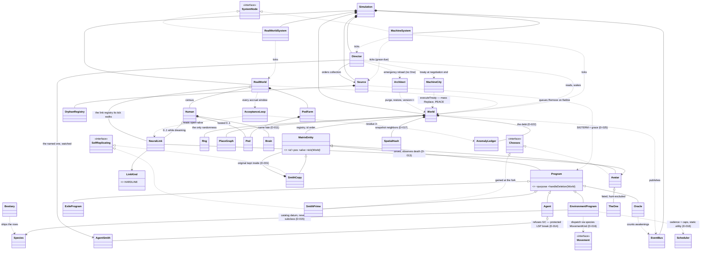
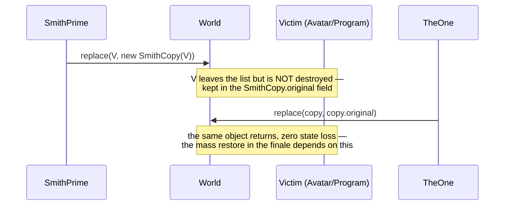
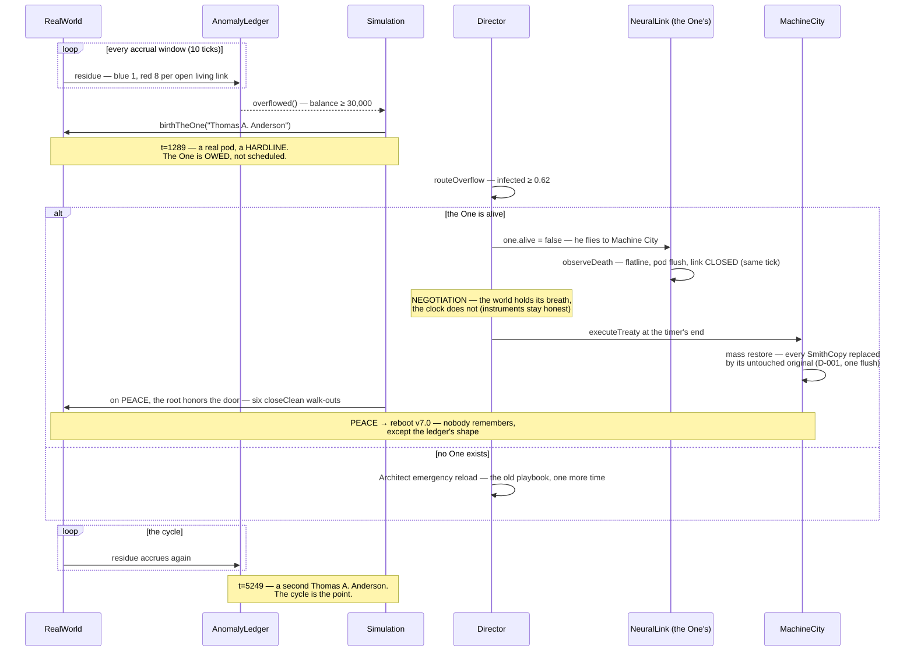
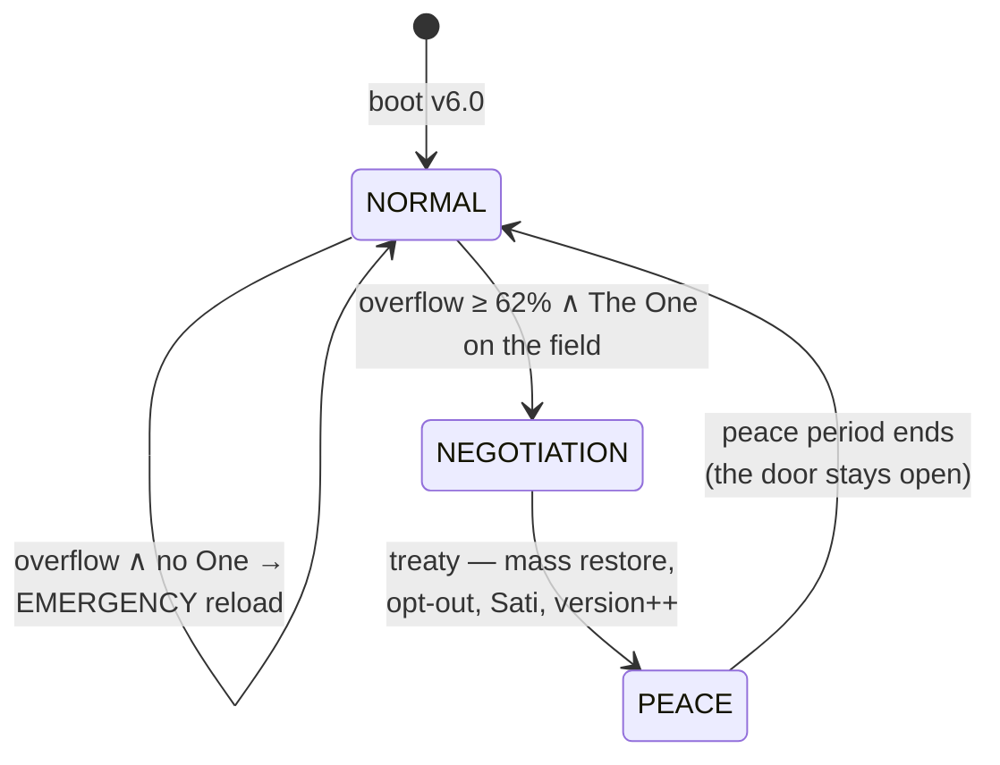

# ARCHITECTURE

One thesis: **the mind is never uploaded** — the brain stays in the real world and connects to the Matrix over live I/O. Everything else is a consequence of that decision.

## Vision — how the real one would be built

The Matrix is not a game engine. It is an **attention-driven, event-sourced dream delivery system**. There is no frontend and there never will be (D-019): the system's only real output is the sensory stream fed to each connected brain. Three founding principles:

1. **Reality is lazily evaluated.** No system serves atom-resolution consistency to billions of minds — and none needs to: nobody observes Tokyo and New York at once. Consistency follows attention: high fidelity where minds are looking, statistics everywhere else. Déjà vu is a stale read caught by an attentive user.
2. **The dream is negotiated, not pushed.** The first Matrix failed because a perfect world was *pushed* and the minds refused it. Every NeuralLink runs an acceptance loop: the world proposes a frame, the mind accepts or resists; the resistance residue is written to a global **anomaly ledger**. When the ledger fills, the birth of The One is a mathematical necessity — "the sum of the remainder of an unbalanced equation." The plot is not scripted; it emerges from error handling. Reload is the GC cycle that clears the ledger; six versions are six of the Architect's A/B experiments.
3. **Everything is a supervised process.** Every bird, gust of wind and traffic light is a purpose-bound process in a supervision tree rooted at the Source. Deprecation is SIGTERM plus a grace period; refuseniks become orphans (the exiles). One assumption is recorded deliberately:

> `ASSUMPTION: processes accept SIGTERM. (This will age badly.)`

The entire trilogy is the collapse of that line. Smith is a process that refused SIGTERM and gained self-replication — the immune system turning autoimmune.

Layer model:

```
L0 SUBSTRATE    pod cluster (brains as processors) + machine silicon; the scheduler
L1 CHRONOS      event-sourced deterministic core: the event log is the ONLY truth
                state = fold(events) · snapshots · digest chain · reload = replay
L2 WORLDSIM     regional simulation shards; fidelity graded by attention
L3 ECOSYSTEM    supervision tree of worker programs; species are data, behavior is strategy
L4 PERCEPTION   per-link acceptance loop → anomaly ledger (where the plot is born)
L5 IMMUNE       Agents (IDS) · Oracle (behavioral model) · déjà vu = hot patch
L6 GOVERNANCE   Architect: reload orchestration, version experiments
```

A one-line systems reading of The One's powers: everyone else's intents pass validation at L4; **The One's intents commit directly to the event log.** Neo has write access — that is why he sees code: he reads the log, not the render. Flying is not a physics violation; it is a permission level.

This repo walks toward that vision in small steps: the digest chain (D-020) is the embryo of Chronos; tick budgets (D-018) are the first step of attention-graded fidelity; the flat anomaly counter dies in v3.0 in favor of the acceptance loop (D-022).

## Package map

| Package | Responsibility | Key types |
|---|---|---|
| `matrix` (root) | Composition root, bootstrap, system nodes | `Simulation`, `Main`, `SystemNode`, `MachineSystem`, `RealWorldSystem` |
| `matrix.core` | Engine: tick, world, events, determinism | `World`, `Director`, `EventBus`, `Rng`, `SystemState` |
| `matrix.realworld` | OUTSIDE the Matrix — the biological layer | `Brain`, `Pod`, `PodFarm`, `NeuralLink` |
| `matrix.machine` | Machine authority | `Source`, `Architect`, `MachineCity`, `OrphanRegistry` |
| `matrix.entities` | INSIDE the Matrix — everyone on the field | `Avatar`, `Program`, `Agent`, `SmithPrime`, `SmithCopy`, `TheOne` |
| `matrix.entities.eco` | The ecosystem: species as data (v2.5) | `Species`, `Kingdom`, `Bestiary`, `EnvironmentProgram` |
| `matrix.entities.behavior` | Pluggable gaits (v2.5) | `Movement`, `FlockMovement`, `SwarmMovement`, ... |

Outside the build, two shop directories: `probes/` (read-only diagnostic instruments compiled against `out/` — the skeptic's bench, contract in `probes/README.md`) and `tools/` (process jigs like the release cutter — `tools/README.md`). Neither ships in the daemon; both are governed by D-030. Every package's threshold now carries its own door: a `package-info.java` stating the room's responsibilities and the invariants you must not break standing in it.

Package boundary = deployment boundary: `realworld` knows no entity behavior, `entities` knows no pod details. The only bridge is `NeuralLink`. Per D-019 there is no presentation layer anywhere: the entity API carries no glyphs, colors or render priorities; the system is observed through the event log, `METRIC` lines and the `DIGEST` chain (D-020), and — eventually — through the perception feed itself (D-021).

## Class relationships — as built (Season One complete: v1.0 → v3.0)

Edge semantics carry the meaning: `*--` **composition** (owns, same fate) · `o--` **aggregation** (holds, separate life) · `-->` **association** (knows) · `..>` **dependency** (uses, never stores) · `<|--`/`<|..` inheritance/realization. Inheritance appears only for true is-a; capabilities are interfaces; one Liskov break stands under protection (D-014).



Dependency direction is law, verified by grep: `entities` imports nothing from `realworld` (the only bridge is `NeuralLink`, which lives on the real-world side and reaches in); `World` holds no real-world objects; nothing depends on `Main`. One legend honesty note from the doc-truth pass: the system-node edges (`MachineSystem ..> World`, `RealWorldSystem ..> RealWorld`, `Director ..> World`, `World ..> EventBus`, `RealWorld ..> World`) are held as final fields — drawn dashed because they are *plumbing conduits, not owned parts* (the owner is the Simulation spine above); read them as "holds a wire", not "uses in passing". The human hierarchy and the program hierarchy never cross — an avatar is driven from outside, a program runs on machine silicon. Two classes hold both worlds, at different altitudes: `Simulation` holds both *aggregates* (it is the composition root — A7), and `NeuralLink` is the only object holding entity-level members of both sides — the jack remains the only bridge at the level where minds live. Season One's late arrivals kept the lattice honest: `EnvironmentProgram` entered under `Program` with species as data (D-015) and gaits as composed strategies (D-016) — one class, twelve species, zero subclasses; `TheOne` entered under `Avatar` (de-finaled for exactly this: one true is-a), excluded from both hunt queries — they tried that in three films; and the ledger cluster (`AcceptanceLoop → AnomalyLedger`) runs on dependencies only, because residue is a flow, not an ownership.

## Sequence — jack-in and the death rule

```mermaid
sequenceDiagram
    participant S as Simulation (root)
    participant RW as RealWorld
    participant NL as NeuralLink (jack)
    participant W as World (Matrix)
    S->>RW: grow() — a Human in a pod
    S->>W: queue Spawn(Avatar) — the brain's PROXY, never an upload
    S->>NL: register(link) — brain and proxy joined at the jack
    loop each tick
        RW->>NL: observeDeath()? — the rule lives on the CONNECTION (D-013)
    end
    alt the avatar dies inside the Matrix
        NL->>NL: brain.flatline(), pod flushed, link closed
        RW->>W: queue Remove — the corpse leaves the world
    end
    Note over NL,W: the dream stream exists per followed link (D-021);<br/>there is no Brain-to-World telemetry path — residue flows<br/>link-to-ledger through the AcceptanceLoop (D-022)
```

## Sequence — Smith infection and restore (Decorator, D-001)



## Sequence — the finale (D-022: the ledger, the One, the treaty)



## State machine — system states



The narrative loop (run by the Director): anomaly accrues in the ledger → **The One is born** → the Source deprecates Smith → `DeletionRefusedException` → **SmithPrime** → exponential spread → the state transitions above.

## Construction view — the build order

The system as a building; every class crown carries its stage label on GitHub.

| Stage | In this repo | Classes / artifacts |
|---|---|---|
| Site survey | v0: docs, principles, decisions | the five documents + the ADRs |
| **Foundation** | determinism + observability — everything rests on it | `Rng`, `Config`, `Event`, `Severity`, `EventBus`, `EventLog`, `MetricsCollector`, `DigestCalculator`, `Digest`, `MetricSnapshot` |
| **Load-bearing skeleton** | composition roots + engine frame — expensive to change later | `Simulation`, `World`, `RealWorld`, `Director`, `SystemState`, `MatrixEntity`, `Program`, `Position` (né Cell — crown #36) |
| **Floors (wings)** | domain layers, phase by phase | biological wing (`Brain`, `Pod`, `PodFarm`, `Human`, `NeuralLink`, `PerceptionFrame`) · Matrix wing (`Avatar`, `Agent`, `Pill`) · machine wing at v2.0 (`Source`, `OrphanRegistry`, the Smith line, `Oracle`, exiles) · v3.0 penthouse (`TheOne`, `AcceptanceLoop`, `AnomalyLedger`, `Architect`, `MachineCity`) |
| **Installations** | cross-cutting services | `SpatialHash` (corridors), `Scheduler` (elevators), the ops console (building management — inline in `Main`, a plane not a class), `--bench` + PERF (the meters) |
| **Landscaping** | v2.5 The Animatrix | `Species`, `Kingdom`, `Bestiary`, `EnvironmentProgram`, the six `Movement` gaits |
| Facade | none — on purpose (D-019) | the building is lived in from the inside; its only window is the perception feed |
| Scaffolding | draft PR #1 | torn down as the real floors rise (issue #25) |
| Inspection | DoDs, digest chain, PERF budgets | every phase ends with a handover run |

Zoning rule: wings are packages, and the fire door between the biological wing and the simulation wing is `NeuralLink` — the only legal passage (A1). Build order inside v1.0: **foundation → skeleton → floors → installations → inspection.**

## Field manual — how not to get lost

The owner's standing order: this system must be worked so well that *we never get lost inside it*. That is not a mood — it is a procedure, and this chapter demonstrates it on a real case from the v3.0 fix round.

### The case of Nadia Petrov

> **As of the `v3.0.0` tag.** Every tick in this case study belongs to the sealed Season One universe and is quoted from a run pinned there (`git archive fa1da4d`, per D-030's pin-to-SHA rule) — the four flips, the 1846 log line, the 4324 walk-out, all reproduce today at that tag. **On current `main` they do not**: Season Two's mechanics moved the film (the README's quickstart carries the same two dated columns — the open door is 4324 at the tag, 4754 on `main`), and re-running `LinkTrace` against `main` prints *one* line for her — `t=0`, and no change through all 6,000 ticks. She is never worn, never freed, and the event log holds nothing under her name at all. PR #230 caught this first and said so for the record. What is pinned here is the **evidence**; the method below it is era-free, which is why the chapter still teaches.

**Symptom (one instrument speaks).** A `--follow "Nadia Petrov"` stream went dark twice — `"signal":"lost"` at tick 1800 and again at 2500 — with frames flowing again *between* the darkenings. A dream that ends should stay ended; a dream that returns should have a reason. The event log, grepped for her name across the whole run, held exactly one line: her walk-out at 4324. Silence where there should have been a story.

**Localize (a probe narrows it).** `probes/LinkTrace.java` replays the identical universe (determinism is what makes the coroner's job possible — same seed, same corpse) and prints every change in her link's `(alive, present, closed, pill)` tuple:

```
# java -cp out:probes/out LinkTrace "Nadia Petrov" 6000 42   — at the v3.0.0 tag; the flip window
t=0 link#0 alive=true present=true closed=false avatarId=8 pill=BLUE
t=1717 link#0 alive=true present=false closed=false avatarId=8 pill=BLUE
t=1846 link#0 alive=true present=true closed=false avatarId=8 pill=BLUE
t=2477 link#0 alive=true present=false closed=false avatarId=8 pill=BLUE
```

(One more line follows at that tag and closes the story — `t=4323 … closed=true`, her exit; the four above are the mystery.)

Same avatar object throughout. Never dead, never closed — but *leaving the world and coming back*. That tuple rules out death, clean exit, and the follow engine itself in one screen.

**Cross-reference (the instruments meet).** The log at the flip ticks: nothing at 1717, nothing at 2477 — but at 1846, one line:

```
[001846] FATE  The One: a copy deleted, an original restored
```

**Mechanism (name it or you haven't finished).** Worn by Smith at 1717 (a `Replace` swaps her for a `SmithCopy` holding her object — D-001), freed by The One at 1846 (his power deletes the copy and restores the original), worn again at 2477, treaty-restored at 4324, and out the open door — free. The hijacks logged nothing because hijack logging is *sampled* at 15% for cascade-throughput reasons; the sampling draw sits behind a deterministic type-check (Avatars only — the Oracle's consumption logs unsampled), so the silence costs no determinism: same universe, same silences. The double-`lost` was two true losses. The system was never wrong — it was telling a story nobody had scripted, and every instrument agreed once they were read together.

### The general method

1. **Trust the symptom's instrument, then interrogate the others.** Each instrument answers a different question class; a mystery is usually one instrument heard alone.
2. **Replay, don't speculate.** Same seed = same universe, byte for byte. Write a probe (`probes/README.md` has the contract and the bench) that watches the exact state the symptom implicates.
3. **Cross-reference at the ticks the probe names.** The log line you need is rarely where you looked first — it is *when* the probe says to look.
4. **Name the mechanism in canon terms** (which decision, which law) and leave the probe on the bench. An investigation that ends without a named mechanism is paused, not solved.

| Question | Instrument |
|---|---|
| *What happened, in story terms?* | event log (grep a name, a tick, a severity) |
| *How much, how many, trending which way?* | METRIC / ECO lines |
| *Are two universes the same universe?* | DIGEST chain (`--selftest`, `probes/ChainDump`) |
| *What does one mind experience?* | the follow stream (JSONL perception frames, D-021) |
| *What state did an object pass through?* | a probe on the bench (`probes/`) |

## The multiverse census — the standing chapter

The instruments got good enough to ask a bigger question: across the multiverse, how common is the film? The census is the continuous program that answers it, and this chapter is its only venue. It is a **chapter, not a document** — D-028 fences the canon at five files plus the door, and this program is the test of whether a year of work can live inside that fence. It can. Raw sweeps stay where they were produced, in PR bodies and issue threads; the chapter carries only the standing tables and the commands that regenerate them. A year of census work adds sections here, never a sixth file.

### How a census entry is written

Every entry, published or forthcoming, carries six parts in this order:

| # | Part | The rule |
|---|---|---|
| 1 | **the question** | one sentence, falsifiable |
| 2 | **the command** | mandatory — an entry that cannot be rerun is an anecdote, and an anecdote is refused |
| 3 | **the sample** | seeds, ticks, scale, era: the exact population the numbers describe |
| 4 | **the table** | the measured rows |
| 5 | **the distribution** | what the numbers mean and, explicitly, what this sample size does *not* license |
| 6 | **the stamp** | date and version measured at, so a v3.0 figure is never read as a v7.5 one |

And the chapter obeys four laws:

1. **Newest question first.** Entries sort by stamp, most recent at the top. Entry numbers are assigned in publication order and never reused, so a citation of "census entry 1" survives every later insertion.
2. **Supersede, never rewrite.** A superseded entry is restated with its successor named, exactly as the ADRs live (D-028's neighbour rule) and for the same reason: a census whose history is editable is a census that can be argued with retroactively. Correcting a typo is an edit; changing a number is a supersession.
3. **Part five is a limit, not a summary.** D-027's *measured, never promised* applied to statistics: a fraction is reported with the interval its sample supports, and the sentence the sample cannot carry is named in the entry rather than left for a reader to infer.
4. **No sixth document.** No `docs/CENSUS.md`, no `journal/`, no per-sweep file. The fence is checked with the entry: `git ls-files '*.md' | grep -vE '^docs/adr/|^tools/|^probes/|^\.github/' | wc -l` must print **6**.

---

### Entry 3 — the second century (standing; first batch of a campaign)

**The question.** What do a hundred more universes do to entry 1's three limits — the `QUIET` fraction's ±8 points, the birth band's shapelessness, and `OLD_PLAYBOOK`'s ~3% ceiling?

**The command.**

```sh
java -cp out:probes/out SeedAtlas 101 200 6000 | tail -1
```

**The sample.** Seeds 101–200, 6,000 ticks each, default scale, film era — measured at `6e2458a`, 12m57s on the reference box. Pooled figures below add the seeds 1–100 re-run **at the same tree** (13m12s), for n=200. Entry 1's published numbers are *not* pooled in: they were measured at v3.0 and pooling across a digest move would invent a multiverse nobody ran.

**The table.**

| Fate | Seeds 101–200 | 95% (Wilson) | Pooled n=200 | 95% (Wilson) |
|---|---|---|---|---|
| `FULL_ARC` | **92 / 100** | 85.0 – 95.9% | **165 / 200** | 76.6 – 87.1% |
| `TREATY` | **2 / 100** | 0.6 – 7.0% | **8 / 200** | 2.0 – 7.7% |
| `QUIET` | **6 / 100** | 2.8 – 12.5% | **27 / 200** | 9.4 – 18.9% |
| `WAR` | 0 | — | 0 | — |
| `OLD_PLAYBOOK` | **0 / 100** | ≤ 3.0% | **0 / 200** | **≤ 1.5%** |

The distributions at n=200 (ticks):

| Beat | mean | sd | median | min | max | n |
|---|---|---|---|---|---|---|
| birth | 1271.0 | **46.6** | 1279 | 1100 | 1359 | 200 |
| overflow | 3946.5 | **593.7** | 3858 | 2963 | 5906 | 173 |
| second birth | 4862.4 | 515.4 | 4829 | 3909 | 5999 | 165 |

Birth, in 25-tick bins: 1100 ×1 · 1125 ×3 · 1150 ×3 · 1175 ×10 · 1200 ×11 · 1225 ×39 · 1250 ×25 · **1275 ×61** · 1300 ×24 · 1325 ×21 · 1350 ×2.

**The distribution.** Three of entry 1's four open questions now have answers, and a fourth opened.

*The band has a shape.* Birth's standard deviation is **46.6 ticks** against a mean of 1271 — a coefficient of variation of 3.7%. The metronome is real and now quantified rather than asserted. The *range*, meanwhile, did exactly what a range does: 220 ticks at n=100 became **259 ticks at n=200**, growing with the sample by construction, which is why the sd is the number this entry reports and the range is a footnote.

*The cascade does not ride the ledger, and this is now measured.* Entry 1 asserted the overflow spread rides population geometry rather than the ledger. Across 173 universes that overflowed, the correlation between birth tick and overflow tick is **r = −0.021** — the ledger's metronome explains four ten-thousandths of the variance in when the war breaks. The spreads say the same thing: overflow's sd is **12.7×** birth's.

*`OLD_PLAYBOOK` is bounded tighter and still not proven.* Zero in 200 puts the branch's rate under **1.5%** by the rule of three. It is not "impossible"; it is "not seen in 200 tries", and only a thousand universes will make that sentence worth its confidence.

*And the alarm.* The two centuries **do not agree with each other**, at the same tree, on the same instrument: `QUIET` is 21/100 in the first and 6/100 in the second — a 15-point gap, 95% CI [5.8, 24.2], pooled **z = 3.10 (p ≈ 0.002)**; `FULL_ARC` is 73 vs 92, **z = −3.54 (p ≈ 0.0004)**. Two contiguous seed blocks drawn from one distribution should not differ like that once in five hundred tries, let alone on the first comparison. Either the seed is not the exchangeable randomizer every census fraction has silently assumed, or the multiverse has structure along the seed axis. Both are census business and neither is settled here.

What n=200 does **not** license: any pooled fraction above, if the century-block effect is real. A `QUIET` interval of 9.4–18.9% assumes the 200 universes are 200 draws from one urn, and the z=3.10 is direct evidence against that assumption; until it is explained, read the pooled row as two 100-seed samples that disagree, not as one 200-seed measurement. Nor does this entry license anything about *this* tree: it is stamped at `6e2458a`, and `src/` has moved since.

**The stamp.** 2026-08-12, v3.0, measured at `6e2458a` · batch 1 of the campaign (seeds 101–200 of 101–1000).

**The batch protocol** — as much the deliverable as the numbers, and binding on the batches that follow:

1. **A batch is 100 seeds at 6,000 ticks**, chosen so one invocation finishes inside a working session (measured: ~13 minutes on the reference box, ~7.8 s per universe).
2. **A partial table states its own n and nothing larger.** A 300-seed interval is written as a 300-seed interval; the campaign's target is 1,000 and no batch may quote the target's precision.
3. **Batches merge only within a tree.** Counts from two trees are never summed — a declared digest move ends the campaign's accumulation and starts a new one, and the re-verdict protocol says which.
4. **Every batch reports the block effect.** Each new century is tested against the pooled prior blocks before its numbers are folded in; the day one of them disagrees is the day the pooling stops, not the day it is quietly averaged away.

---

### Entry 2 — the beat drift table (standing, appended per recorded commit)

**The question.** Is the film's timing drifting, merge by merge?

**The command.**

```sh
java -cp out:probes/out CensusBeatDrift 42,7 6000 --band 200 --baseline "<the row above>"
```

A row is recorded at a tree pinned by `git archive <sha>`, which has no `.git` to ask, so a pinned row stamps itself with `--sha <short>`.

**The sample.** Seeds 42 and 7 — the repo's two standard universes, plural by design so a drift that is really a one-universe accident cannot masquerade as a systemic one — 6,000 ticks each, one row per recorded commit. The beats are D-036's eight, extracted by the same sequential scan `ArcBeats` uses, so the recorded ticks are the ticks CI's gate actually saw.

**The table.** Newest commit last, because a drift table is read downward.

| commit | seed | birth | refusal | overflow | flatline | peace | reboot | door | second_birth |
|---|---|---|---|---|---|---|---|---|---|
| `2b49550` (v3.0.0) | 42 | 1289 | 1525 | 4284 | 4284 | 4304 | 4324 | 4324 | 5249 |
| `2b49550` (v3.0.0) | 7 | 1289 | 1525 | 3334 | 3334 | 3354 | 3374 | 3374 | 4299 |
| `62e12ac` (#200 merged) | 42 | 1289 | 1525 | 4302 | 4302 | 4322 | 4342 | 4342 | 5269 |
| `62e12ac` (#200 merged) | 7 | 1289 | 1525 | 3215 | 3215 | 3235 | 3255 | 3255 | 4239 |
| `ca8ed5e` (#222 merged) | 42 | 1299 | 1525 | 4290 | 4290 | 4310 | 4330 | 4330 | 5239 |
| `ca8ed5e` (#222 merged) | 7 | 1259 | 1525 | 3707 | 3707 | 3727 | 3747 | 3747 | 4659 |
| `0cad45b` (main) | 42 | 1299 | 1525 | 4290 | 4290 | 4310 | 4330 | 4330 | 5239 |
| `0cad45b` (main) | 7 | 1259 | 1525 | 3707 | 3707 | 3727 | 3747 | 3747 | 4659 |

Per-step maxima, at a declared band of **200 ticks**:

| step | seed 42 | seed 7 | verdict |
|---|---|---|---|
| `2b49550` → `62e12ac` | 20 | 119 | `DRIFT_WITHIN_BAND` |
| `62e12ac` → `ca8ed5e` | 30 | **492** | **`DRIFT_FLAGGED`** — overflow, flatline, peace, reboot, door all +492; second birth +420 |
| `ca8ed5e` → `0cad45b` | 0 | 0 | `DRIFT_WITHIN_BAND` — a whole stretch of merges, timing-neutral |

**The distribution.** `refusal` has not moved a single tick in the repo's entire history: 1525 in every row, both seeds. Everything downstream of the overflow has moved in every declared break, and the moves are **rigid** — at #222, seed 7's overflow, flatline, peace, reboot and door all slid by exactly +492 together, which is the signature of a cascade that started later rather than a finale that runs differently. Second birth slid +420, less than the block, so the post-reboot leg absorbed 72 ticks of the shift.

What this table does **not** license: two seeds is not a distribution, and `DRIFT_WITHIN_BAND` at n=2 means "neither of two universes moved", never "the film is stable". The 200-tick band is a **declared convention, not a measured tolerance** — nothing here establishes that 200 is the right number, only that it is the number this table was judged against, stated before the rows were read. And four commits out of hundreds is a sparse sample of the repo's history: the table can prove a specific step moved the film, and cannot prove any step did not, because the steps between rows were never measured.

**The stamp.** 2026-08-12, v3.0 · rows measured at four pinned trees; `0cad45b` is main at the time of writing.

---

### Entry 1 — the first century (standing)

**The question.** Across the multiverse, how common is the film — and does any universe take the Architect's emergency reload?

**The command.**

```sh
java -cp out:probes/out SeedAtlas 1 100 6000 | tail -1
```

**The sample.** Seeds 1–100, 6,000 ticks each, default scale, the film era (no truce corridor). `probes/SeedAtlas` verdicts each universe from its own framed log; one command regenerates the whole table after any mechanics change.

**The table.**

| Fate | Universes | Meaning |
|---|---|---|
| `FULL_ARC` | **80 / 100** | birth → war → overflow → treaty → reboot → second birth: the film, complete |
| `TREATY` | **3 / 100** (seeds 51, 68, 82) | peace reached, second birth still pending at tick 6,000 — the cycle runs, just slower than the window |
| `QUIET` | **17 / 100** (seeds 2, 5, 6, 8, 21, 24, 32, 33, 34, 61, 63, 72, 80, 83, 91, 95, 99) | the One is born, Smith forks — and the cascade never reaches the 0.62 overflow line. **Smith loses the race about one universe in six.** |
| `WAR` | 0 | no universe overflowed without resolving |
| `OLD_PLAYBOOK` | **0 / 100** | the Architect's emergency reload — overflow with no One alive — has never once occurred in nature. The branch exists in code, in the ops console (`reload`), and in the verification skeptic's forced probe; a hundred universes refuse it, because the ledger births the One (median 1289) long before any cascade can overflow (earliest ever seen: 2872). A dead branch that is also a proof: the film's ORDER is emergent law, not script. |

**The distribution.** Birth arrives in a **220-tick band** (min 1159 · median 1289 · max 1379) — the ledger is a metronome; whatever else a universe does, it owes the One at almost the same moment. War length is where universes differ wildly (overflow min 2872 · median 3686 · max 5728), because the cascade rides population geometry, not the ledger. Second births, where they arrive, land at median 4674 (min 3889 · max 5739).

What n=100 does **not** license: 17/100 QUIET is a 95% interval of roughly 10–26%, so "one universe in six" is honest only as a point estimate — one in ten and one in four both survive this sample. The 220-tick birth band is a *range*, and a range grows with the sample by construction: it is not a shape and carries no tail. And `OLD_PLAYBOOK = 0/100` bounds that branch's rate at about 3%, no tighter — a hundred universes cannot distinguish *impossible* from *rare*. Each of those three limits is a question the second century is being run to answer.

**The stamp.** 2026-08-11, v3.0 · falsifiable the way everything here is: rerun the command, diff the table.

**Reproduction check — and the first thing the stamp caught.** Rerun at `6e2458a` on 2026-08-12, the same command prints a different multiverse:

```
ATLAS seeds=1..100 ticks=6000 full_arc=73 treaty=6 war=0 quiet=21 old_playbook=0 birth_min=1149 birth_max=1359
```

Neither run is wrong. The entry is stamped **v3.0**, and main has since taken Season Two's declared digest moves, each of which re-rolls the stream from boot and therefore re-rolls every universe's war. The table above was describing a multiverse that no longer exists, and nothing in the repo said so — which is the whole argument for a stamp, and the whole argument against editing numbers in place. Entry 1 stands as the v3.0 measurement. Restating it at HEAD is not an edit anyone may make by hand: it is owed to the re-verdict protocol, which classifies the move first and supersedes the entry only if the classification says it must.

---

The rng-stream instrumentation rides the same bench and is quoted here as context rather than as a census entry: `DrawMeter` puts the boot at 1,728 draws, the steady city near 398 per tick, the cascade near 503 — and the negotiation freeze at exactly zero across its forty ticks, which is "the world holds its breath" as a measured law rather than prose.
