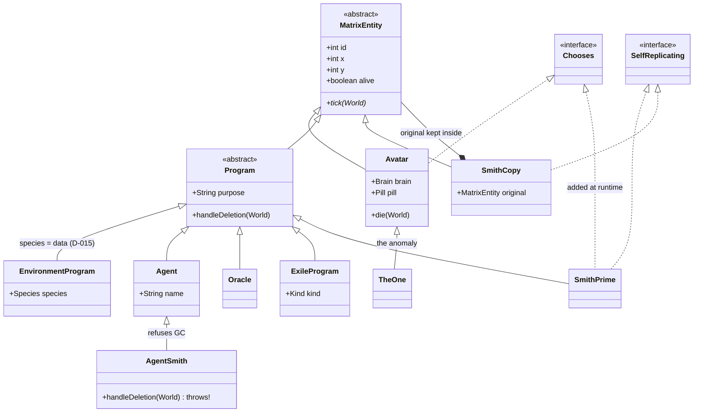
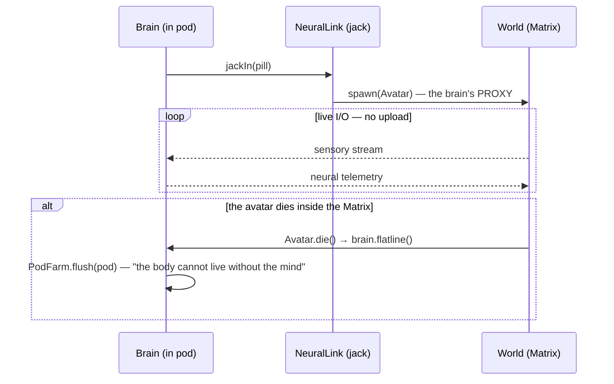
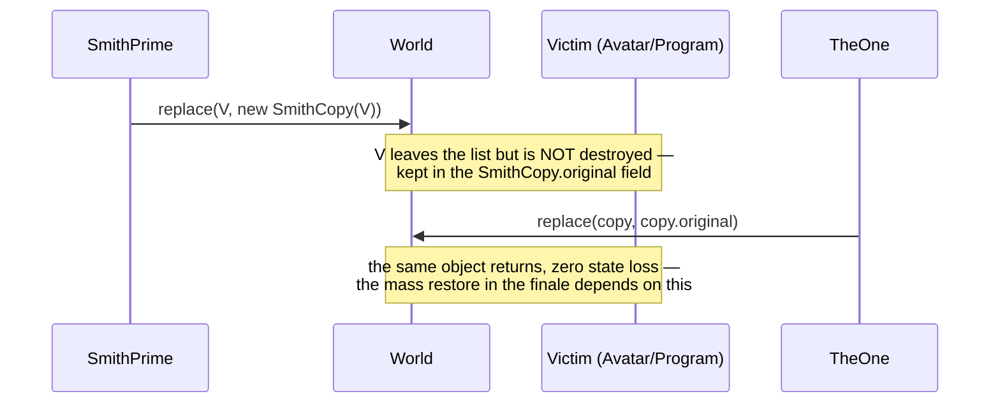
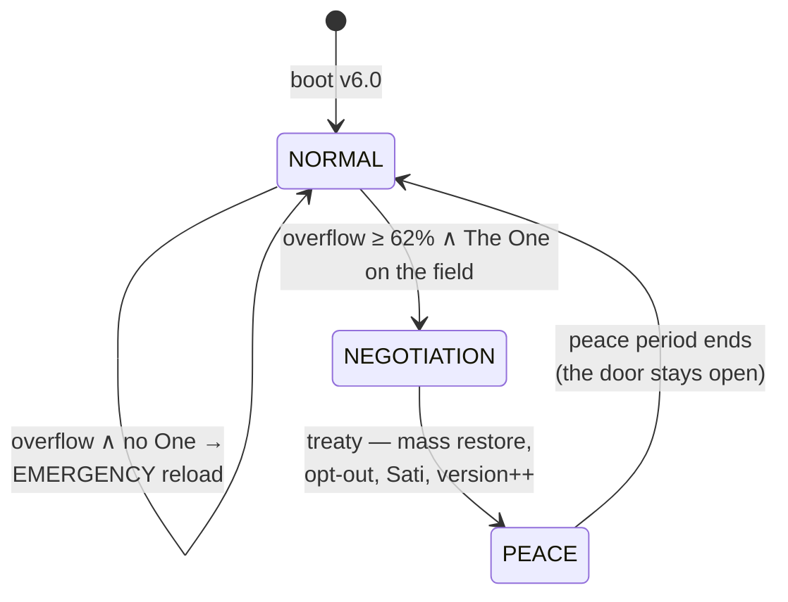

# ARCHITECTURE

One thesis: **the mind is never uploaded** — the brain stays in the real world and connects to the Matrix over live I/O. Everything else is a consequence of that decision.

## Vision — how the real one would be built

The Matrix is not a game engine. It is an **attention-driven, event-sourced dream delivery system**. There is no frontend and there never will be (D-019): the system's only real output is the sensory stream fed to each connected brain. Three founding principles:

1. **Reality is lazily evaluated.** No system serves atom-resolution consistency to billions of minds — and none needs to: nobody observes Tokyo and New York at once. Consistency follows attention: high fidelity where minds are looking, statistics everywhere else. Déjà vu is a stale read caught by an attentive user.
2. **The dream is negotiated, not pushed.** The first Matrix failed because a perfect world was *pushed* and the minds refused it. Every NeuralLink runs an acceptance loop: the world proposes a frame, the mind accepts or resists; the resistance residue is written to a global **anomaly ledger**. When the ledger fills, the birth of The One is a mathematical necessity — "the sum of the remainder of an unbalanced equation." The plot is not scripted; it emerges from error handling. Reload is the GC cycle that clears the ledger; six versions are six of the Architect's A/B experiments.
3. **Everything is a supervised process.** Every bird, gust of wind and traffic light is a purpose-bound process in a supervision tree rooted at the Source. Deprecation is SIGTERM plus a grace period; refuseniks become orphans (the exiles). One assumption is recorded deliberately:

> `ASSUMPTION: processes accept SIGTERM. (This will age badly.)`

The entire trilogy is the collapse of that line. Smith is a process that refused SIGTERM and gained self-replication — the immune system turning autoimmune.

Layer model:

```
L0 SUBSTRATE    pod cluster (brains as processors) + machine silicon; the scheduler
L1 CHRONOS      event-sourced deterministic core: the event log is the ONLY truth
                state = fold(events) · snapshots · digest chain · reload = replay
L2 WORLDSIM     regional simulation shards; fidelity graded by attention
L3 ECOSYSTEM    supervision tree of worker programs; species are data, behavior is strategy
L4 PERCEPTION   per-link acceptance loop → anomaly ledger (where the plot is born)
L5 IMMUNE       Agents (IDS) · Oracle (behavioral model) · déjà vu = hot patch
L6 GOVERNANCE   Architect: reload orchestration, version experiments
```

A one-line systems reading of The One's powers: everyone else's intents pass validation at L4; **The One's intents commit directly to the event log.** Neo has write access — that is why he sees code: he reads the log, not the render. Flying is not a physics violation; it is a permission level.

This repo walks toward that vision in small steps: the digest chain (D-020) is the embryo of Chronos; tick budgets (D-018) are the first step of attention-graded fidelity; the flat anomaly counter dies in v3.0 in favor of the acceptance loop (D-022).

## Package map

| Package | Responsibility | Key types |
|---|---|---|
| `matrix` (root) | Daemon bootstrap + ops console wiring | `Main` |
| `matrix.core` | Engine: tick, world, events, determinism | `World`, `Director`, `EventBus`, `Rng`, `SystemState` |
| `matrix.realworld` | OUTSIDE the Matrix — the biological layer | `Brain`, `Pod`, `PodFarm`, `NeuralLink` |
| `matrix.machine` | Machine authority | `Source`, `Architect`, `MachineCity`, `ComputeModel` |
| `matrix.entities` | INSIDE the Matrix — everyone on the field | `Avatar`, `Program`, `Agent`, `SmithPrime`, `SmithCopy`, `TheOne` |

Package boundary = deployment boundary: `realworld` knows no entity behavior, `entities` knows no pod details. The only bridge is `NeuralLink`. Per D-019 there is no presentation layer anywhere: the entity API carries no glyphs, colors or render priorities; the system is observed through the event log, `METRIC` lines and the `DIGEST` chain (D-020), and — eventually — through the perception feed itself (D-021).

## Class diagram — who is human, who is program



The critical distinction: `Avatar.brain` lives **in the real world** (see the sequence below), while a `Program`'s hardware is on the machine side. Neo descends from the human line and never becomes a program; Smith is `Program`-line from start to finish. The two hierarchies never cross. Two proposals refine this picture: D-013 replaces the `Avatar.brain` edge with a NeuralLink observer bridge (so `entities` imports nothing from `realworld`), and D-011 adds a `Human` class on the real-world side so unplugged people are representable. `EnvironmentProgram` is the single class behind every bird, flower and insect — a species is a catalog row, not a class (D-015), and its behavior is a plugged-in strategy (D-016).

## Sequence — jack-in and the death rule



## Sequence — Smith infection and restore (Decorator, D-001)



## State machine — system states



The narrative loop (run by the Director): anomaly accrues in the ledger → **The One is born** → the Source deprecates Smith → `DeletionRefusedException` → **SmithPrime** → exponential spread → the state transitions above.
