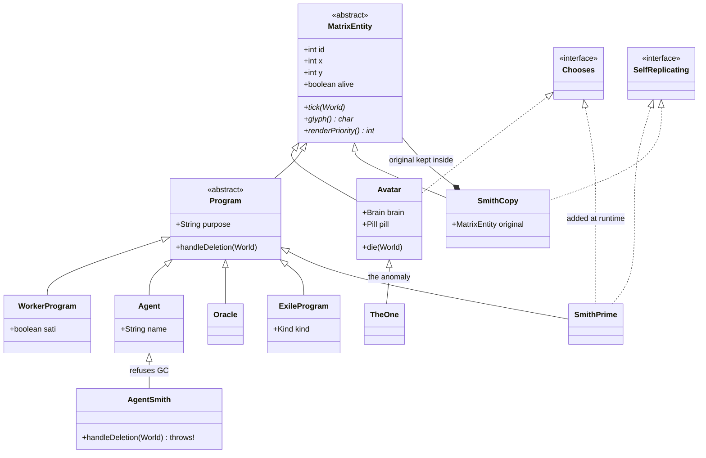
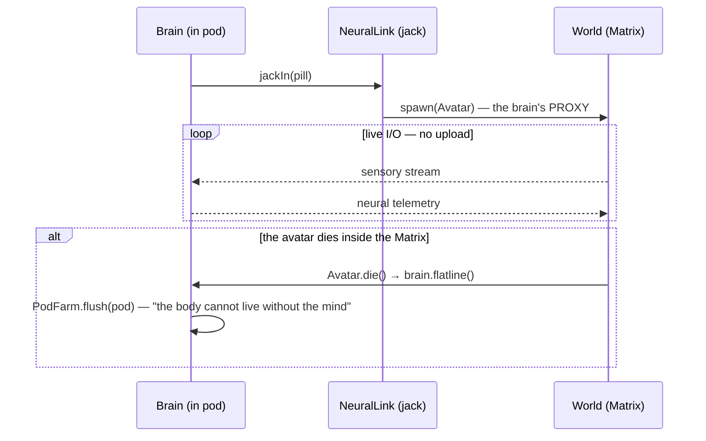
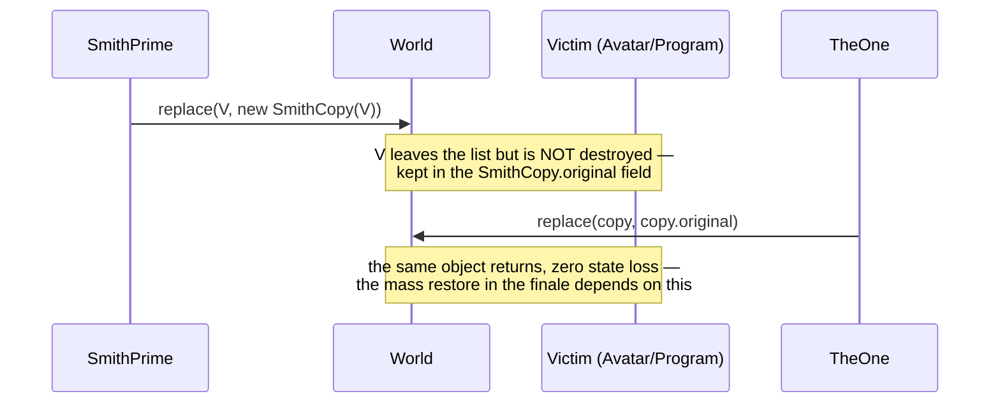
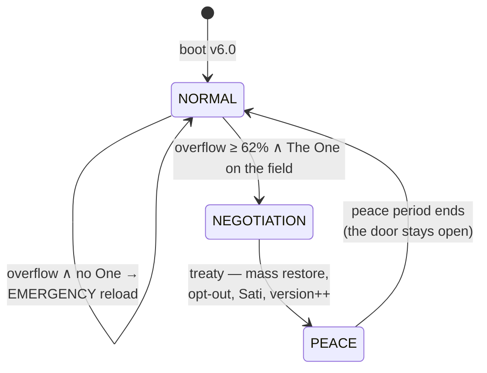

# ARCHITECTURE

One thesis, four diagrams: **the mind is never uploaded** — the brain stays in the real world and connects to the Matrix over live I/O. Everything else is a consequence of that decision.

## Package map

| Package | Responsibility | Key types |
|---|---|---|
| `matrix.core` | Engine: tick, world, events, determinism | `World`, `Director`, `EventBus`, `Rng`, `SystemState` |
| `matrix.realworld` | OUTSIDE the Matrix — the biological layer | `Brain`, `Pod`, `PodFarm`, `NeuralLink` |
| `matrix.machine` | Machine authority | `Source`, `Architect`, `MachineCity`, `ComputeModel` |
| `matrix.entities` | INSIDE the Matrix — everyone on the field | `Avatar`, `Program`, `Agent`, `SmithPrime`, `SmithCopy`, `TheOne` |
| `matrix.sim` | Presentation | `TerminalRenderer`, `Main` |

Package boundary = deployment boundary: `realworld` knows no entity behavior, `entities` knows no pod details. The only bridge is `NeuralLink`.

## Class diagram — who is human, who is program

The critical distinction: `Avatar.brain` lives **in the real world** (see deployment), while a `Program`'s hardware is on the machine side. Neo descends from the human line and never becomes a program; Smith is `Program`-line from start to finish. The two hierarchies never cross.

## Sequence — jack-in and the death rule

## Sequence — Smith infection and restore (Decorator, D-001)

## State machine — system states

The narrative loop (run by the Director): anomaly builds → **The One is born** → the Source deprecates Smith → `DeletionRefusedException` → **SmithPrime** → exponential spread → the state transitions above.
