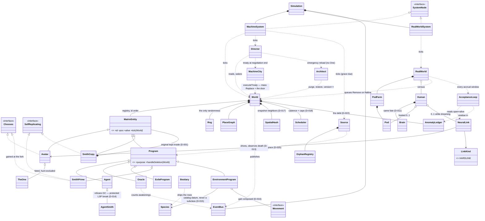
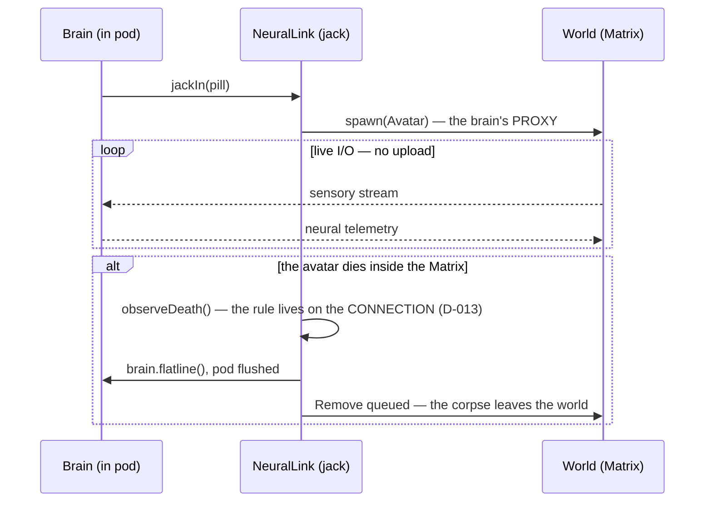
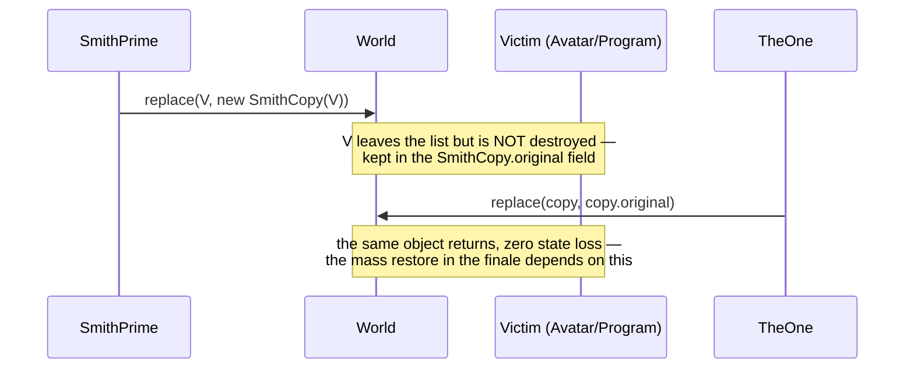
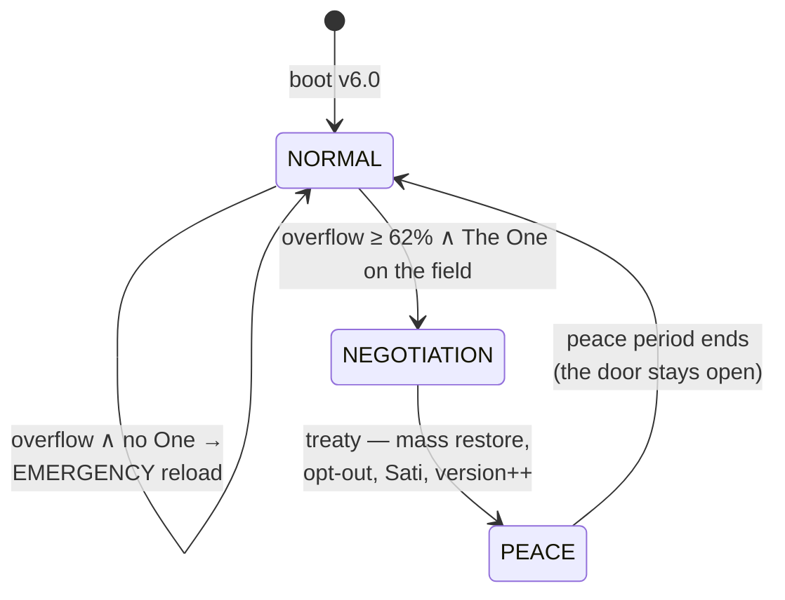

# ARCHITECTURE

One thesis: **the mind is never uploaded** — the brain stays in the real world and connects to the Matrix over live I/O. Everything else is a consequence of that decision.

## Vision — how the real one would be built

The Matrix is not a game engine. It is an **attention-driven, event-sourced dream delivery system**. There is no frontend and there never will be (D-019): the system's only real output is the sensory stream fed to each connected brain. Three founding principles:

1. **Reality is lazily evaluated.** No system serves atom-resolution consistency to billions of minds — and none needs to: nobody observes Tokyo and New York at once. Consistency follows attention: high fidelity where minds are looking, statistics everywhere else. Déjà vu is a stale read caught by an attentive user.
2. **The dream is negotiated, not pushed.** The first Matrix failed because a perfect world was *pushed* and the minds refused it. Every NeuralLink runs an acceptance loop: the world proposes a frame, the mind accepts or resists; the resistance residue is written to a global **anomaly ledger**. When the ledger fills, the birth of The One is a mathematical necessity — "the sum of the remainder of an unbalanced equation." The plot is not scripted; it emerges from error handling. Reload is the GC cycle that clears the ledger; six versions are six of the Architect's A/B experiments.
3. **Everything is a supervised process.** Every bird, gust of wind and traffic light is a purpose-bound process in a supervision tree rooted at the Source. Deprecation is SIGTERM plus a grace period; refuseniks become orphans (the exiles). One assumption is recorded deliberately:

> `ASSUMPTION: processes accept SIGTERM. (This will age badly.)`

The entire trilogy is the collapse of that line. Smith is a process that refused SIGTERM and gained self-replication — the immune system turning autoimmune.

Layer model:

```
L0 SUBSTRATE    pod cluster (brains as processors) + machine silicon; the scheduler
L1 CHRONOS      event-sourced deterministic core: the event log is the ONLY truth
                state = fold(events) · snapshots · digest chain · reload = replay
L2 WORLDSIM     regional simulation shards; fidelity graded by attention
L3 ECOSYSTEM    supervision tree of worker programs; species are data, behavior is strategy
L4 PERCEPTION   per-link acceptance loop → anomaly ledger (where the plot is born)
L5 IMMUNE       Agents (IDS) · Oracle (behavioral model) · déjà vu = hot patch
L6 GOVERNANCE   Architect: reload orchestration, version experiments
```

A one-line systems reading of The One's powers: everyone else's intents pass validation at L4; **The One's intents commit directly to the event log.** Neo has write access — that is why he sees code: he reads the log, not the render. Flying is not a physics violation; it is a permission level.

This repo walks toward that vision in small steps: the digest chain (D-020) is the embryo of Chronos; tick budgets (D-018) are the first step of attention-graded fidelity; the flat anomaly counter dies in v3.0 in favor of the acceptance loop (D-022).

## Package map

| Package | Responsibility | Key types |
|---|---|---|
| `matrix` (root) | Daemon bootstrap + ops console wiring | `Main` |
| `matrix.core` | Engine: tick, world, events, determinism | `World`, `Director`, `EventBus`, `Rng`, `SystemState` |
| `matrix.realworld` | OUTSIDE the Matrix — the biological layer | `Brain`, `Pod`, `PodFarm`, `NeuralLink` |
| `matrix.machine` | Machine authority | `Source`, `Architect`, `MachineCity`, `ComputeModel` |
| `matrix.entities` | INSIDE the Matrix — everyone on the field | `Avatar`, `Program`, `Agent`, `SmithPrime`, `SmithCopy`, `TheOne` |
| `matrix.entities.eco` | The ecosystem: species as data (v2.5) | `Species`, `Kingdom`, `Bestiary`, `EnvironmentProgram` |
| `matrix.entities.behavior` | Pluggable gaits (v2.5) | `Movement`, `FlockMovement`, `SwarmMovement`, ... |

Outside the build, two shop directories: `probes/` (read-only diagnostic instruments compiled against `out/` — the skeptic's bench, contract in `probes/README.md`) and `tools/` (process jigs like the release cutter — `tools/README.md`). Neither ships in the daemon; both are governed by D-030. Every package's threshold now carries its own door: a `package-info.java` stating the room's responsibilities and the invariants you must not break standing in it.

Package boundary = deployment boundary: `realworld` knows no entity behavior, `entities` knows no pod details. The only bridge is `NeuralLink`. Per D-019 there is no presentation layer anywhere: the entity API carries no glyphs, colors or render priorities; the system is observed through the event log, `METRIC` lines and the `DIGEST` chain (D-020), and — eventually — through the perception feed itself (D-021).

## Class relationships — as built (Season One complete: v1.0 → v3.0)

Edge semantics carry the meaning: `*--` **composition** (owns, same fate) · `o--` **aggregation** (holds, separate life) · `-->` **association** (knows) · `..>` **dependency** (uses, never stores) · `<|--`/`<|..` inheritance/realization. Inheritance appears only for true is-a; capabilities are interfaces; one Liskov break stands under protection (D-014).



Dependency direction is law, verified by grep: `entities` imports nothing from `realworld` (the only bridge is `NeuralLink`, which lives on the real-world side and reaches in); `World` holds no real-world objects; nothing depends on `Main`. The human hierarchy and the program hierarchy never cross — an avatar is driven from outside, a program runs on machine silicon, and the one object that ever holds both worlds is the jack. Season One's late arrivals kept the lattice honest: `EnvironmentProgram` entered under `Program` with species as data (D-015) and gaits as composed strategies (D-016) — one class, twelve species, zero subclasses; `TheOne` entered under `Avatar` (de-finaled for exactly this: one true is-a), excluded from both hunt queries — they tried that in three films; and the ledger cluster (`AcceptanceLoop → AnomalyLedger`) runs on dependencies only, because residue is a flow, not an ownership.

## Sequence — jack-in and the death rule



## Sequence — Smith infection and restore (Decorator, D-001)



## State machine — system states



The narrative loop (run by the Director): anomaly accrues in the ledger → **The One is born** → the Source deprecates Smith → `DeletionRefusedException` → **SmithPrime** → exponential spread → the state transitions above.

## Construction view — the build order

The system as a building; every class crown carries its stage label on GitHub.

| Stage | In this repo | Classes / artifacts |
|---|---|---|
| Site survey | v0: docs, principles, decisions | the five documents + the ADRs |
| **Foundation** | determinism + observability — everything rests on it | `Rng`, `Config`, `Event`, `Severity`, `EventBus`, `EventLog`, `MetricsCollector`, `DigestCalculator`, `Digest`, `MetricSnapshot` |
| **Load-bearing skeleton** | composition roots + engine frame — expensive to change later | `Simulation`, `World`, `RealWorld`, `Director`, `SystemState`, `MatrixEntity`, `Program`, `Cell` |
| **Floors (wings)** | domain layers, phase by phase | biological wing (`Brain`, `Pod`, `PodFarm`, `Human`, `NeuralLink`, `PerceptionFrame`) · Matrix wing (`Avatar`, `Agent`, `Pill`) · machine wing at v2.0 (`Source`, `OrphanRegistry`, the Smith line, `Oracle`, exiles) · v3.0 penthouse (`TheOne`, `AcceptanceLoop`, `AnomalyLedger`, `Architect`, `MachineCity`) |
| **Installations** | cross-cutting services | `SpatialHash` (corridors), `Scheduler` (elevators), `OpsConsole` (building management), `--bench` + PERF (the meters) |
| **Landscaping** | v2.5 The Animatrix | `Species`, `Kingdom`, `Bestiary`, `EnvironmentProgram`, the six `Movement` gaits |
| Facade | none — on purpose (D-019) | the building is lived in from the inside; its only window is the perception feed |
| Scaffolding | draft PR #1 | torn down as the real floors rise (issue #25) |
| Inspection | DoDs, digest chain, PERF budgets | every phase ends with a handover run |

Zoning rule: wings are packages, and the fire door between the biological wing and the simulation wing is `NeuralLink` — the only legal passage (A1). Build order inside v1.0: **foundation → skeleton → floors → installations → inspection.**

## Field manual — how not to get lost

The owner's standing order: this system must be worked so well that *we never get lost inside it*. That is not a mood — it is a procedure, and this chapter demonstrates it on a real case from the v3.0 fix round.

### The case of Nadia Petrov

**Symptom (one instrument speaks).** A `--follow "Nadia Petrov"` stream went dark twice — `"signal":"lost"` at tick 1800 and again at 2500 — with frames flowing again *between* the darkenings. A dream that ends should stay ended; a dream that returns should have a reason. The event log, grepped for her name across the whole run, held exactly one line: her walk-out at 4324. Silence where there should have been a story.

**Localize (a probe narrows it).** `probes/LinkTrace.java` replays the identical universe (determinism is what makes the coroner's job possible — same seed, same corpse) and prints every change in her link's `(alive, present, closed, pill)` tuple:

```
t=0     alive=true present=true  closed=false avatarId=8
t=1717  alive=true present=false closed=false avatarId=8
t=1846  alive=true present=true  closed=false avatarId=8
t=2477  alive=true present=false closed=false avatarId=8
```

Same avatar object throughout. Never dead, never closed — but *leaving the world and coming back*. That tuple rules out death, clean exit, and the follow engine itself in one screen.

**Cross-reference (the instruments meet).** The log at the flip ticks: nothing at 1717, nothing at 2477 — but at 1846, one line:

```
[001846] FATE  The One: a copy deleted, an original restored
```

**Mechanism (name it or you haven't finished).** Worn by Smith at 1717 (a `Replace` swaps her for a `SmithCopy` holding her object — D-001), freed by The One at 1846 (his power deletes the copy and restores the original), worn again at 2477, treaty-restored at 4324, and out the open door — free. The hijacks logged nothing because hijack logging is *sampled* at 15% for cascade-throughput reasons; the rng draw is unconditional, so the silence costs no determinism. The double-`lost` was two true losses. The system was never wrong — it was telling a story nobody had scripted, and every instrument agreed once they were read together.

### The general method

1. **Trust the symptom's instrument, then interrogate the others.** Each instrument answers a different question class; a mystery is usually one instrument heard alone.
2. **Replay, don't speculate.** Same seed = same universe, byte for byte. Write a probe (`probes/README.md` has the contract and the bench) that watches the exact state the symptom implicates.
3. **Cross-reference at the ticks the probe names.** The log line you need is rarely where you looked first — it is *when* the probe says to look.
4. **Name the mechanism in canon terms** (which decision, which law) and leave the probe on the bench. An investigation that ends without a named mechanism is paused, not solved.

| Question | Instrument |
|---|---|
| *What happened, in story terms?* | event log (grep a name, a tick, a severity) |
| *How much, how many, trending which way?* | METRIC / ECO lines |
| *Are two universes the same universe?* | DIGEST chain (`--selftest`, `probes/ChainDump`) |
| *What does one mind experience?* | the follow stream (JSONL perception frames, D-021) |
| *What state did an object pass through?* | a probe on the bench (`probes/`) |
