# matrix-sim — the UML 2.5.1 set

Every diagram type the standard defines, applied to this codebase. Read at `54e6616`.

**UML 2.5.1 defines fourteen diagram types**, not thirteen and not seventeen — seven
structural and seven behavioural. UML 2.0 had thirteen; 2.5 added the profile diagram.
All fourteen are below, in the standard's own order.

Every relationship here was extracted from the source: `import` statements for the
package graph, `extends`/`implements` for the hierarchies, field declarations for
composition. Nothing is drawn from intent.

**On fidelity.** GitHub renders Mermaid, and Mermaid natively supports four of the
fourteen: class, sequence, state machine, and (as flowchart) activity. The other ten are
drawn in Mermaid using UML notation and conventions — stereotypes in guillemets, ports,
lifelines, artifacts. Where the rendering is an approximation rather than the real
notation, the diagram says so directly above itself. A diagram that quietly pretends to be
something it is not would be the same defect this repository files issues about.

---

## Contents

**Structural**

| # | Diagram | Subject |
|---|---|---|
| 1 | [Class](#1--class-diagram) | the entity hierarchy and its five contracts |
| 2 | [Object](#2--object-diagram) | one instant: seed 42 at tick 4599 |
| 3 | [Package](#3--package-diagram) | ten packages and the one-way doors |
| 4 | [Component](#4--component-diagram) | daemon, instruments, lane |
| 5 | [Composite structure](#5--composite-structure-diagram) | the inside of `Simulation` |
| 6 | [Deployment](#6--deployment-diagram) | one JVM, two classpath roots, one runner |
| 7 | [Profile](#7--profile-diagram) | the stereotypes this project actually defines |

**Behavioural**

| # | Diagram | Subject |
|---|---|---|
| 8 | [Use case](#8--use-case-diagram) | what `Main` will do, and for whom |
| 9 | [Activity](#9--activity-diagram) | one tick, end to end |
| 10 | [State machine](#10--state-machine-diagram) | the system's arc, and one link's life |
| 11 | [Sequence](#11--sequence-diagram) | the nine causal phases as messages |
| 12 | [Communication](#12--communication-diagram) | the same interaction, by structure |
| 13 | [Interaction overview](#13--interaction-overview-diagram) | boot, loop, seal |
| 14 | [Timing](#14--timing-diagram) | one pilot's link across 6,000 ticks |

---

# Structural diagrams

## 1 · Class diagram

The core hierarchy. One abstract base with one abstract operation; the split that matters
is `Program` (native to the simulation) against `Avatar` (a body piloted from outside).
`TheOne` is an `Avatar` with a different fate, never a different kind of thing.

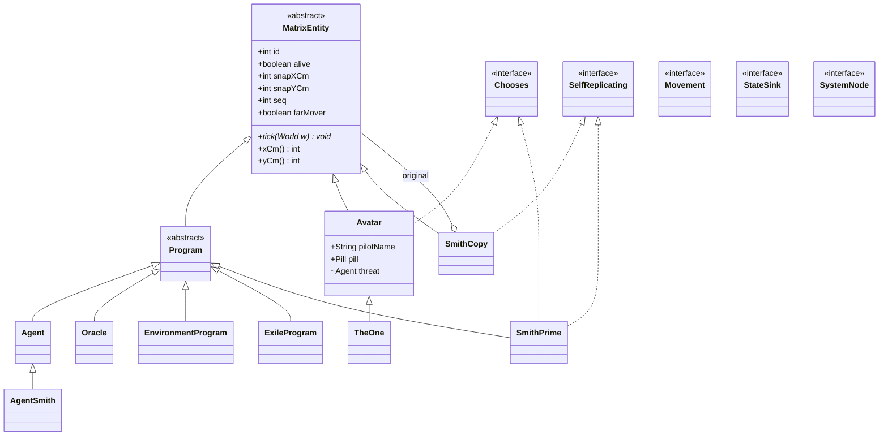
```mermaid
classDiagram
  direction TB

  class MatrixEntity {
    <<abstract>>
    +int id
    +boolean alive
    +int snapXCm
    +int snapYCm
    +int seq
    +boolean farMover
    +tick(World w)* void
    +xCm() int
    +yCm() int
  }

  class Program {
    <<abstract>>
  }

  class Avatar {
    +String pilotName
    +Pill pill
    ~Agent threat
  }

  class TheOne
  class Agent
  class AgentSmith
  class Oracle
  class EnvironmentProgram
  class ExileProgram
  class SmithCopy
  class SmithPrime

  class Chooses {
    <<interface>>
  }
  class SelfReplicating {
    <<interface>>
  }
  class Movement {
    <<interface>>
  }
  class StateSink {
    <<interface>>
  }
  class SystemNode {
    <<interface>>
  }

  MatrixEntity <|-- Program
  MatrixEntity <|-- Avatar
  MatrixEntity <|-- SmithCopy
  Program <|-- Agent
  Program <|-- Oracle
  Program <|-- EnvironmentProgram
  Program <|-- ExileProgram
  Program <|-- SmithPrime
  Agent <|-- AgentSmith
  Avatar <|-- TheOne

  Chooses <|.. Avatar
  Chooses <|.. SmithPrime
  SelfReplicating <|.. SmithCopy
  SelfReplicating <|.. SmithPrime

  SmithCopy o-- MatrixEntity : original
```

`SmithCopy` keeps a reference to whatever it overwrote — which is why the awakening cap has
to count wrapped minds as well as present ones, and why a mass restore could once snap the
red count past its ceiling.

The five interfaces and their realisations:

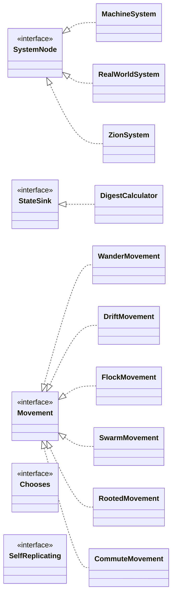
```mermaid
classDiagram
  direction LR

  class SystemNode { <<interface>> }
  class StateSink { <<interface>> }
  class Movement { <<interface>> }
  class Chooses { <<interface>> }
  class SelfReplicating { <<interface>> }

  class MachineSystem
  class RealWorldSystem
  class ZionSystem
  class DigestCalculator
  class WanderMovement
  class DriftMovement
  class FlockMovement
  class SwarmMovement
  class RootedMovement
  class CommuteMovement

  SystemNode <|.. MachineSystem
  SystemNode <|.. RealWorldSystem
  SystemNode <|.. ZionSystem
  StateSink <|.. DigestCalculator
  Movement <|.. WanderMovement
  Movement <|.. DriftMovement
  Movement <|.. FlockMovement
  Movement <|.. SwarmMovement
  Movement <|.. RootedMovement
  Movement <|.. CommuteMovement
```

`StateSink` has exactly one implementor and that is deliberate: the canonical hasher is the
only thing permitted to consume the state walk.

### The sealed types

Three sealed hierarchies. The compiler enumerates each, so no fourth branch can appear
without the switch statements refusing to compile.

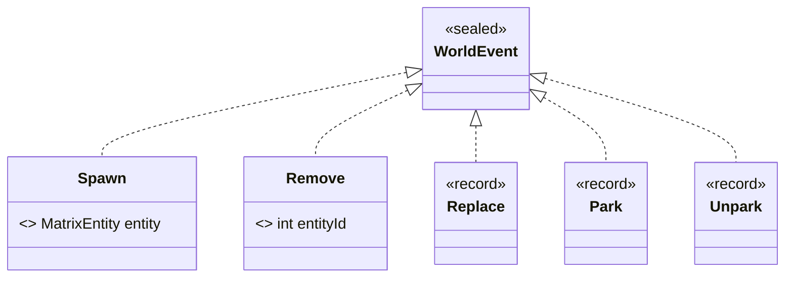
```mermaid
classDiagram
  direction TB

  class WorldEvent { <<sealed>> }
  class Spawn { <<record>> MatrixEntity entity }
  class Remove { <<record>> int entityId }
  class Replace { <<record>> }
  class Park { <<record>> }
  class Unpark { <<record>> }

  WorldEvent <|.. Spawn
  WorldEvent <|.. Remove
  WorldEvent <|.. Replace
  WorldEvent <|.. Park
  WorldEvent <|.. Unpark
```

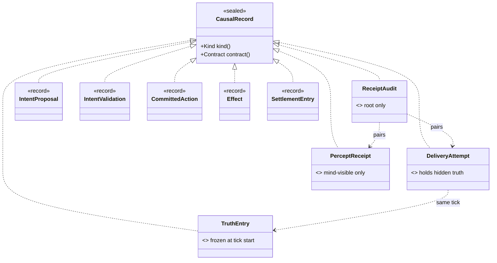
```mermaid
classDiagram
  direction TB

  class CausalRecord {
    <<sealed>>
    +Kind kind()
    +Contract contract()
  }
  class TruthEntry { <<record>> frozen at tick start }
  class DeliveryAttempt { <<record>> holds hidden truth }
  class PerceptReceipt { <<record>> mind-visible only }
  class ReceiptAudit { <<record>> root only }
  class IntentProposal { <<record>> }
  class IntentValidation { <<record>> }
  class CommittedAction { <<record>> }
  class Effect { <<record>> }
  class SettlementEntry { <<record>> }

  CausalRecord <|.. TruthEntry
  CausalRecord <|.. DeliveryAttempt
  CausalRecord <|.. PerceptReceipt
  CausalRecord <|.. ReceiptAudit
  CausalRecord <|.. IntentProposal
  CausalRecord <|.. IntentValidation
  CausalRecord <|.. CommittedAction
  CausalRecord <|.. Effect
  CausalRecord <|.. SettlementEntry

  DeliveryAttempt ..> TruthEntry : same tick
  ReceiptAudit ..> PerceptReceipt : pairs
  ReceiptAudit ..> DeliveryAttempt : pairs
```

The split is physical in the type graph. A `PerceptReceipt` contains only the projection a
mind may read; hidden truth and actual source live in `DeliveryAttempt`. Passing a receipt
to a mind therefore *cannot* accidentally pass the audit object that justified it.

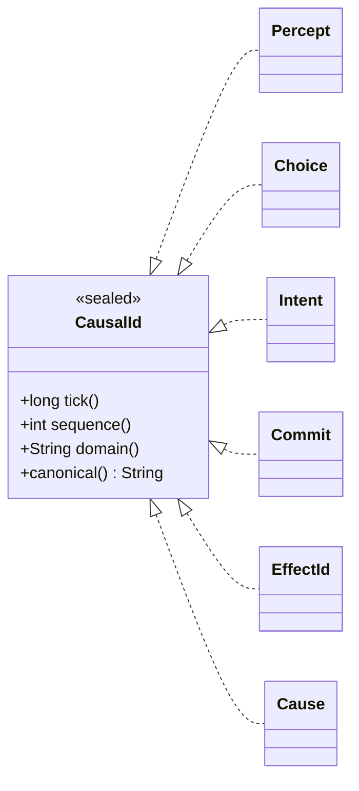
```mermaid
classDiagram
  direction LR

  class CausalId {
    <<sealed>>
    +long tick()
    +int sequence()
    +String domain()
    +canonical() String
  }
  class Percept
  class Choice
  class Intent
  class Commit
  class EffectId
  class Cause

  CausalId <|.. Percept
  CausalId <|.. Choice
  CausalId <|.. Intent
  CausalId <|.. Commit
  CausalId <|.. EffectId
  CausalId <|.. Cause
```

---

## 2 · Object diagram

*A class diagram says what may exist; an object diagram says what does, at one instant.*
This is seed 42 at tick 4599 — the tick a recorded command is stamped for.

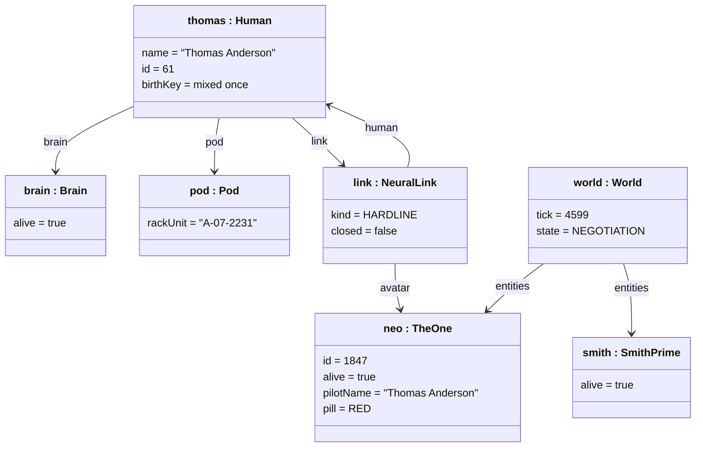
```mermaid
classDiagram
  direction TB

  class neo["neo : TheOne"] {
    id = 1847
    alive = true
    pilotName = "Thomas Anderson"
    pill = RED
  }
  class thomas["thomas : Human"] {
    name = "Thomas Anderson"
    id = 61
    birthKey = mixed once
  }
  class brain61["brain : Brain"] {
    alive = true
  }
  class pod61["pod : Pod"] {
    rackUnit = "A-07-2231"
  }
  class link61["link : NeuralLink"] {
    kind = HARDLINE
    closed = false
  }
  class world["world : World"] {
    tick = 4599
    state = NEGOTIATION
  }
  class smith["smith : SmithPrime"] {
    alive = true
  }

  thomas --> brain61 : brain
  thomas --> pod61 : pod
  thomas --> link61 : link
  link61 --> thomas : human
  link61 --> neo : avatar
  world --> neo : entities
  world --> smith : entities
```

Two things read straight off the instance graph. The link points both ways — it is the only
object holding a `Human` and an `Avatar` at once. And `pod` is populated here but is
nullable in general: the free-born never had a rack unit, so every reader guards.

---

## 3 · Package diagram

Ten packages. The architecture's central claim is a *direction*, not a shape.

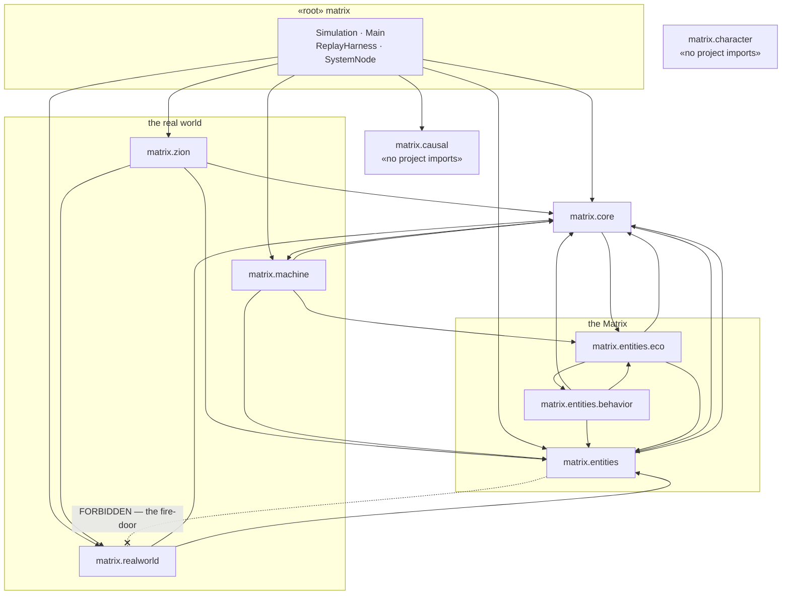
```mermaid
flowchart TB
  subgraph ROOT["«root» matrix"]
    SIM["Simulation · Main<br/>ReplayHarness · SystemNode"]
  end

  subgraph DREAM["the Matrix"]
    ENT["matrix.entities"]
    BEH["matrix.entities.behavior"]
    ECO["matrix.entities.eco"]
  end

  subgraph FLESH["the real world"]
    RW["matrix.realworld"]
    ZI["matrix.zion"]
    MA["matrix.machine"]
  end

  CORE["matrix.core"]
  CH["matrix.character<br/>«no project imports»"]
  CA["matrix.causal<br/>«no project imports»"]

  SIM --> CORE
  SIM --> ENT
  SIM --> RW
  SIM --> ZI
  SIM --> MA
  SIM --> CA
  ENT --> CORE
  BEH --> CORE
  BEH --> ENT
  BEH --> ECO
  ECO --> CORE
  ECO --> ENT
  ECO --> BEH
  RW --> CORE
  RW --> ENT
  ZI --> CORE
  ZI --> ENT
  ZI --> RW
  MA --> CORE
  MA --> ENT
  MA --> ECO
  CORE --> ENT
  CORE --> ECO
  CORE --> MA

  ENT -. "FORBIDDEN — the fire-door" .-x RW
```

`entities` imports `core` and nothing else. A body in the dream cannot reach the mind that
is dreaming it, and that is not a convention — it is an audited dependency edge that must
stay empty. `character` and `causal` import nothing from the project at all; they are
vocabulary, not machinery.

| Package | Imports | Files |
|---|---|---|
| `matrix` | core, entities, realworld, zion, machine, causal | 9 |
| `matrix.core` | entities, entities.eco, machine | 30 |
| `matrix.entities` | core | 16 |
| `matrix.entities.behavior` | core, entities, entities.eco | 8 |
| `matrix.entities.eco` | core, entities, entities.behavior | 6 |
| `matrix.realworld` | core, entities | 12 |
| `matrix.zion` | core, entities, realworld | 4 |
| `matrix.machine` | core, entities, entities.eco | 8 |
| `matrix.character` | — | 6 |
| `matrix.causal` | — | 4 |

---

## 4 · Component diagram

> *Approximation.* Mermaid has no component-diagram renderer. Drawn as a flowchart using
> UML component conventions: `«component»` stereotypes, provided interfaces named on the
> connectors.

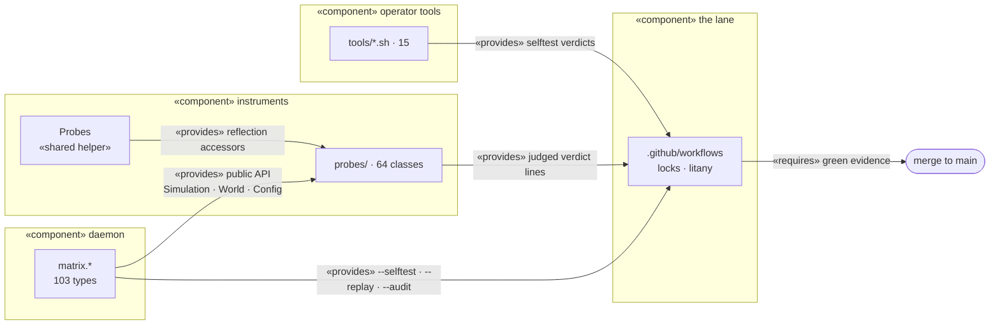
```mermaid
flowchart LR
  subgraph PROD["«component» daemon"]
    D1["matrix.*<br/>103 types"]
  end

  subgraph INST["«component» instruments"]
    P1["probes/ · 64 classes"]
    P2["Probes<br/>«shared helper»"]
  end

  subgraph OPS["«component» operator tools"]
    T1["tools/*.sh · 15"]
  end

  subgraph LANE["«component» the lane"]
    C1[".github/workflows<br/>locks · litany"]
  end

  D1 -- "«provides» public API<br/>Simulation · World · Config" --> P1
  P2 -- "«provides» reflection accessors" --> P1
  P1 -- "«provides» judged verdict lines" --> C1
  T1 -- "«provides» selftest verdicts" --> C1
  D1 -- "«provides» --selftest · --replay · --audit" --> C1
  C1 -- "«requires» green evidence" --> MERGE(["merge to main"])
```

The dependency runs one way: the daemon knows nothing about the probes that measure it.
`D-009`'s claim is that `src/` builds and self-tests with `probes/` removed entirely, and
the lane executes exactly that as a step.

---

## 5 · Composite structure diagram

> *Approximation.* Mermaid has no composite-structure renderer. Drawn as a flowchart with
> UML internal-structure conventions: parts inside the classifier, ports on its boundary.

The inside of `Simulation` — the only classifier in the system that holds both worlds.

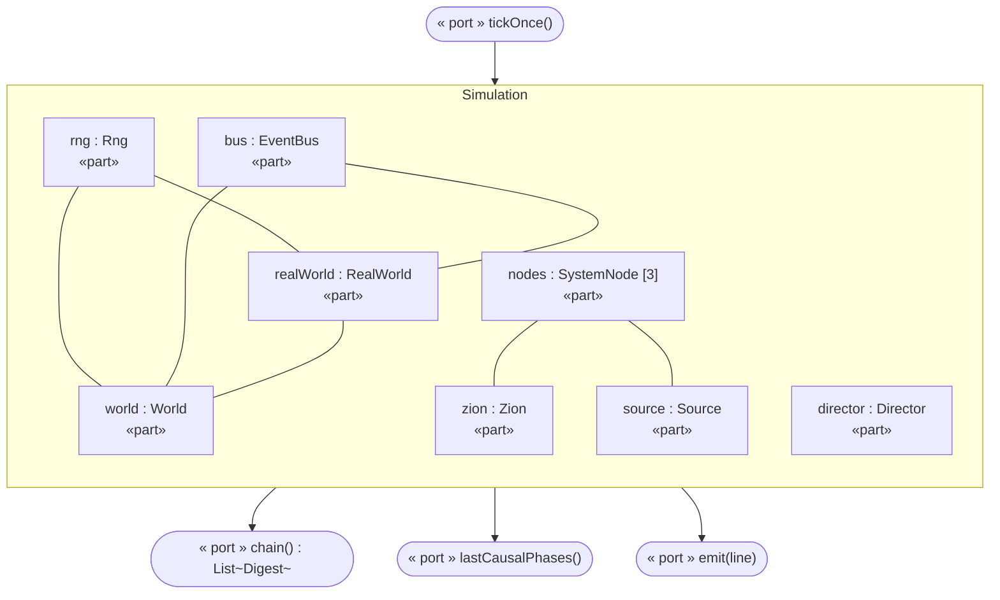
```mermaid
flowchart TB
  subgraph SIM["Simulation"]
    direction TB
    PRNG["rng : Rng<br/>«part»"]
    PBUS["bus : EventBus<br/>«part»"]
    PW["world : World<br/>«part»"]
    PRW["realWorld : RealWorld<br/>«part»"]
    PZ["zion : Zion<br/>«part»"]
    PS["source : Source<br/>«part»"]
    PD["director : Director<br/>«part»"]
    PN["nodes : SystemNode [3]<br/>«part»"]

    PRNG --- PW
    PRNG --- PRW
    PBUS --- PW
    PBUS --- PRW
    PRW --- PW
    PN --- PZ
    PN --- PS
  end

  PORT_IN(["« port » tickOnce()"]) --> SIM
  SIM --> PORT_DIG(["« port » chain() : List~Digest~"])
  SIM --> PORT_PH(["« port » lastCausalPhases()"])
  SIM --> PORT_OUT(["« port » emit(line)"])
```

One `Rng` is wired to both worlds — a single seeded stream is what makes the whole run
reproducible, and a second source of randomness anywhere would end that. `realWorld` may
reference `world`; the connector has no reverse.

---

## 6 · Deployment diagram

> *Approximation.* Mermaid has no deployment renderer. Drawn as a flowchart with UML
> deployment conventions: `«device»` and `«execution environment»` nodes, `«artifact»`
> boxes, deployment edges.

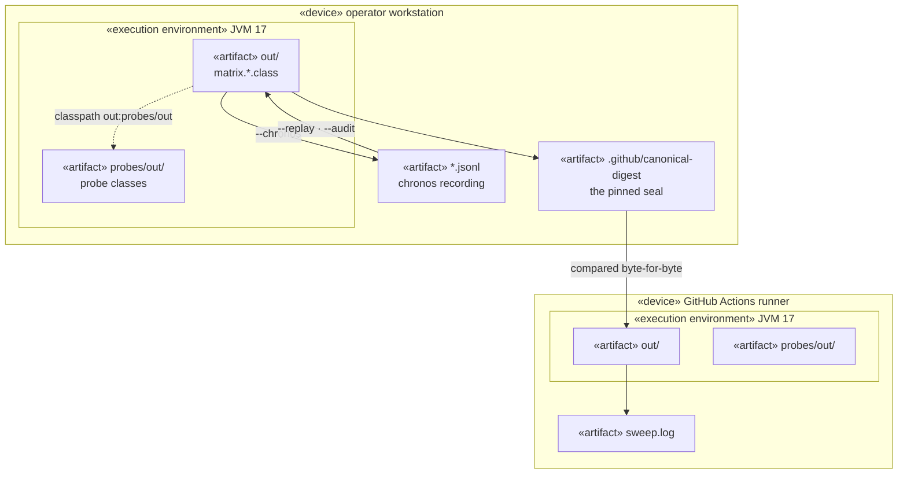
```mermaid
flowchart TB
  subgraph DEV["«device» operator workstation"]
    subgraph JVM1["«execution environment» JVM 17"]
      A1["«artifact» out/<br/>matrix.*.class"]
      A2["«artifact» probes/out/<br/>probe classes"]
      A1 -.->|"classpath out:probes/out"| A2
    end
    A3["«artifact» *.jsonl<br/>chronos recording"]
    A4["«artifact» .github/canonical-digest<br/>the pinned seal"]
  end

  subgraph CI["«device» GitHub Actions runner"]
    subgraph JVM2["«execution environment» JVM 17"]
      B1["«artifact» out/"]
      B2["«artifact» probes/out/"]
    end
    B3["«artifact» sweep.log"]
  end

  A1 -->|"--chronos"| A3
  A3 -->|"--replay · --audit"| A1
  A1 --> A4
  B1 --> B3
  A4 -->|"compared byte-for-byte"| B1
```

The ordering trap is on the classpath itself: `out/` shadows `probes/out/`, so a stale probe
class in `out/` makes a fix look like it did nothing. Both trees are removed before any run
that is going to be believed.

---

## 7 · Profile diagram

*A profile diagram defines the stereotypes a project extends the UML metamodel with.* This
one is unusually real for this codebase, because the repository genuinely defines its own
marker and enforces it in a build gate.

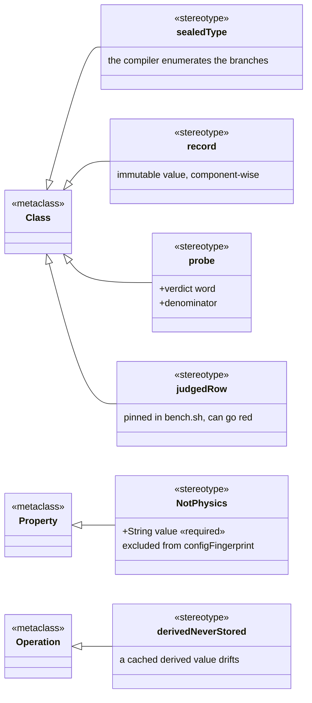
```mermaid
classDiagram
  direction LR

  class Class {
    <<metaclass>>
  }
  class Property {
    <<metaclass>>
  }
  class Operation {
    <<metaclass>>
  }

  class sealedType {
    <<stereotype>>
    the compiler enumerates the branches
  }
  class record {
    <<stereotype>>
    immutable value, component-wise
  }
  class NotPhysics {
    <<stereotype>>
    +String value  «required»
    excluded from configFingerprint
  }
  class probe {
    <<stereotype>>
    +verdict word
    +denominator
  }
  class judgedRow {
    <<stereotype>>
    pinned in bench.sh, can go red
  }
  class derivedNeverStored {
    <<stereotype>>
    a cached derived value drifts
  }

  Class <|-- sealedType
  Class <|-- record
  Class <|-- probe
  Class <|-- judgedRow
  Property <|-- NotPhysics
  Operation <|-- derivedNeverStored
```

`«NotPhysics»` is the only one of these that exists as real Java. It carries a **required**
reason string: a marker that can be applied silently is an opt-out that gets spent to make a
red build green, so the annotation forces the exclusion to be an argument somebody wrote
down. The others are conventions this repository enforces through probes rather than through
the type system — but they behave exactly like stereotypes, which is why they belong here
and not in a style guide.

---

# Behavioural diagrams

## 8 · Use case diagram

> *Approximation.* Mermaid has no use-case renderer. Drawn as a flowchart with UML use-case
> conventions: actors outside the boundary, ovals inside, `«include»` and `«extend»`.

Derived from the seventeen long options `Main` actually parses.

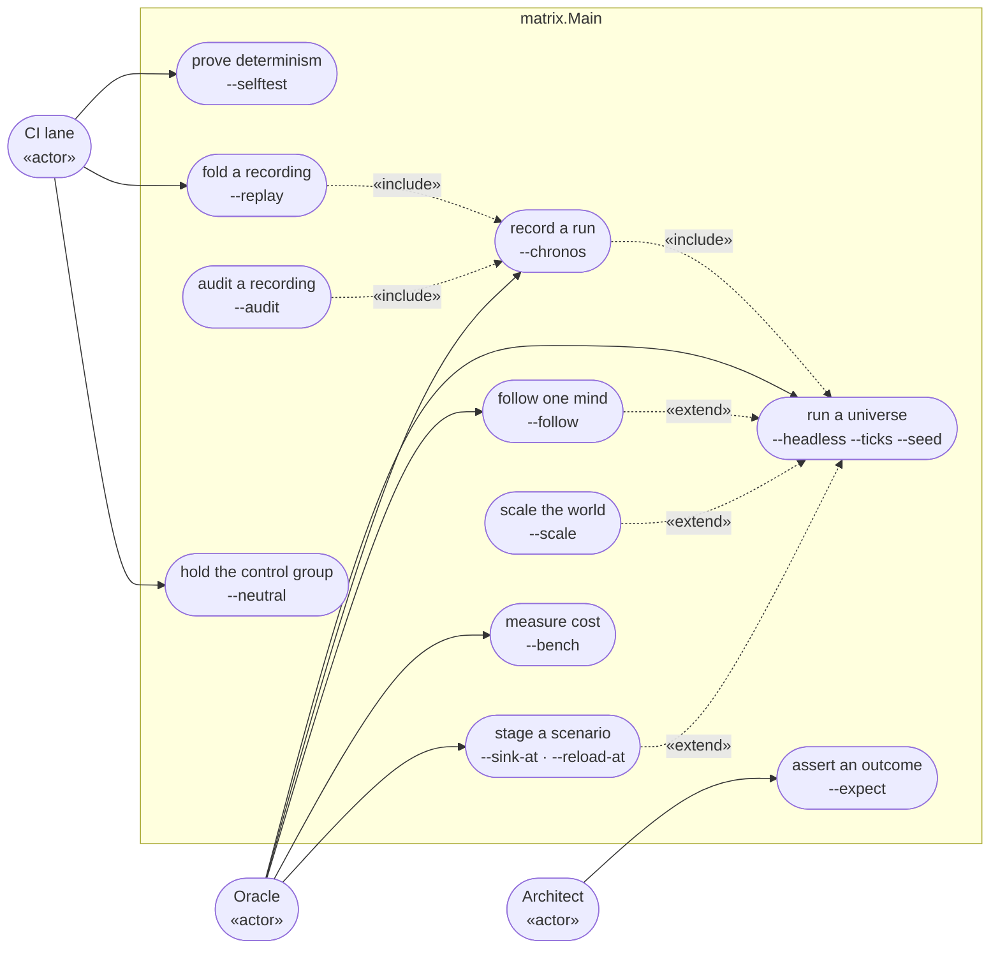
```mermaid
flowchart LR
  ARCH(["Architect<br/>«actor»"])
  ORACLE(["Oracle<br/>«actor»"])
  LANE(["CI lane<br/>«actor»"])

  subgraph SYS["matrix.Main"]
    U1(["run a universe<br/>--headless --ticks --seed"])
    U2(["prove determinism<br/>--selftest"])
    U3(["record a run<br/>--chronos"])
    U4(["fold a recording<br/>--replay"])
    U5(["audit a recording<br/>--audit"])
    U6(["follow one mind<br/>--follow"])
    U7(["measure cost<br/>--bench"])
    U8(["scale the world<br/>--scale"])
    U9(["stage a scenario<br/>--sink-at · --reload-at"])
    U10(["hold the control group<br/>--neutral"])
    U11(["assert an outcome<br/>--expect"])
  end

  ARCH --> U11
  ORACLE --> U1
  ORACLE --> U3
  ORACLE --> U6
  ORACLE --> U7
  ORACLE --> U9
  LANE --> U2
  LANE --> U4
  LANE --> U10

  U3 -.->|"«include»"| U1
  U4 -.->|"«include»"| U3
  U5 -.->|"«include»"| U3
  U9 -.->|"«extend»"| U1
  U8 -.->|"«extend»"| U1
  U6 -.->|"«extend»"| U1
```

The actor split is D-037's, not a diagramming convenience: the Architect states outcomes and
gives verdicts, the Oracle runs and reads, and the lane is a third actor that only ever asks
falsifiable questions.

---

## 9 · Activity diagram

One tick, from the caller's `tickOnce()` to a sealed chain link. Drawn as a Mermaid
flowchart, which is the standard's activity notation minus the swimlane frames.

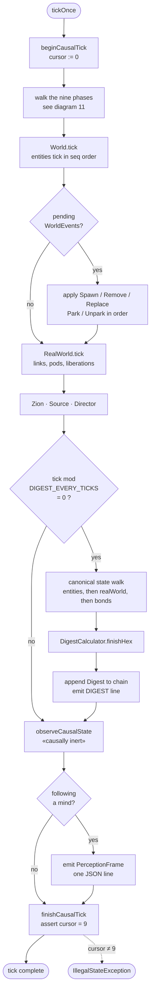
```mermaid
flowchart TB
  START([tickOnce]) --> BEGIN["beginCausalTick<br/>cursor := 0"]
  BEGIN --> PH["walk the nine phases<br/>see diagram 11"]
  PH --> WT["World.tick<br/>entities tick in seq order"]
  WT --> Q{"pending<br/>WorldEvents?"}
  Q -->|yes| APPLY["apply Spawn / Remove / Replace<br/>Park / Unpark in order"]
  Q -->|no| RWT
  APPLY --> RWT["RealWorld.tick<br/>links, pods, liberations"]
  RWT --> ZT["Zion · Source · Director"]
  ZT --> DIGQ{"tick mod<br/>DIGEST_EVERY_TICKS<br/>= 0 ?"}
  DIGQ -->|no| OBS
  DIGQ -->|yes| WALK["canonical state walk<br/>entities, then realWorld, then bonds"]
  WALK --> HASH["DigestCalculator.finishHex"]
  HASH --> LINK["append Digest to chain<br/>emit DIGEST line"]
  LINK --> OBS["observeCausalState<br/>«causally inert»"]
  OBS --> FOLLOWQ{"following<br/>a mind?"}
  FOLLOWQ -->|yes| FRAME["emit PerceptionFrame<br/>one JSON line"]
  FOLLOWQ -->|no| FIN
  FRAME --> FIN["finishCausalTick<br/>assert cursor = 9"]
  FIN --> END([tick complete])

  FIN -.->|"cursor ≠ 9"| ERR([IllegalStateException])
```

Two ordering facts are load-bearing. The digest walk puts the framed real-side segment
*after* the entity walk, because only the root holds both banks. And the observation hook
runs after the seal — a combined final step would let an observer move before the seal while
the phase list still looked unchanged.

---

## 10 · State machine diagram

The system's own arc. `SystemState` has three constants and the transitions are driven by
world events, not by a clock.

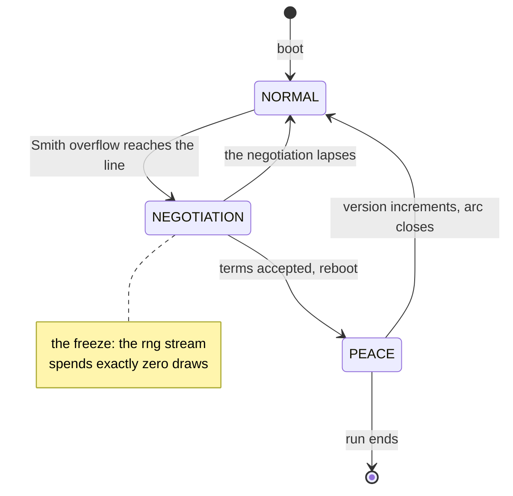
```mermaid
stateDiagram-v2
  [*] --> NORMAL : boot
  NORMAL --> NEGOTIATION : Smith overflow reaches the line
  NEGOTIATION --> PEACE : terms accepted, reboot
  NEGOTIATION --> NORMAL : the negotiation lapses
  PEACE --> NORMAL : version increments, arc closes
  PEACE --> [*] : run ends

  note right of NEGOTIATION
    the freeze: the rng stream
    spends exactly zero draws
  end note
```

One `NeuralLink`'s life — the state that decides whether a walk-out was liberation or loss.

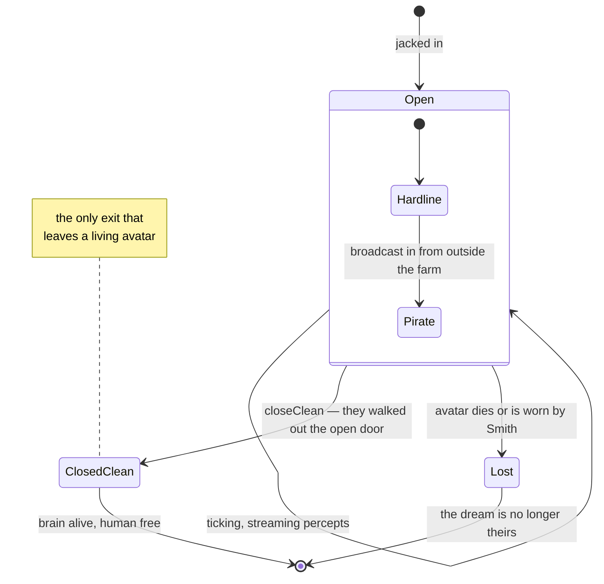
```mermaid
stateDiagram-v2
  [*] --> Open : jacked in
  Open --> Open : ticking, streaming percepts

  state Open {
    [*] --> Hardline
    Hardline --> Pirate : broadcast in from outside the farm
  }

  Open --> ClosedClean : closeClean — they walked out the open door
  Open --> Lost : avatar dies or is worn by Smith
  ClosedClean --> [*] : brain alive, human free
  Lost --> [*] : the dream is no longer theirs

  note left of ClosedClean
    the only exit that
    leaves a living avatar
  end note
```

---

## 11 · Sequence diagram

The nine causal phases as messages. This is the D-066 boundary in its executable form: a
mind receives only what was delivered, and an intent stays a proposal until the root commits
it.

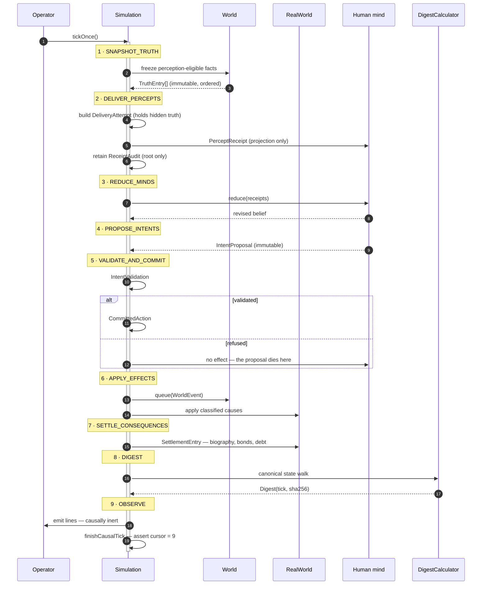
```mermaid
sequenceDiagram
  autonumber
  participant OP as Operator
  participant SIM as Simulation
  participant W as World
  participant RW as RealWorld
  participant M as Human mind
  participant DC as DigestCalculator

  OP->>SIM: tickOnce()
  activate SIM

  Note over SIM: 1 · SNAPSHOT_TRUTH
  SIM->>W: freeze perception-eligible facts
  W-->>SIM: TruthEntry[] (immutable, ordered)

  Note over SIM: 2 · DELIVER_PERCEPTS
  SIM->>SIM: build DeliveryAttempt (holds hidden truth)
  SIM->>M: PerceptReceipt (projection only)
  SIM->>SIM: retain ReceiptAudit (root only)

  Note over SIM: 3 · REDUCE_MINDS
  SIM->>M: reduce(receipts)
  M-->>SIM: revised belief

  Note over SIM: 4 · PROPOSE_INTENTS
  M-->>SIM: IntentProposal (immutable)

  Note over SIM: 5 · VALIDATE_AND_COMMIT
  SIM->>SIM: IntentValidation
  alt validated
    SIM->>SIM: CommittedAction
  else refused
    SIM->>M: no effect — the proposal dies here
  end

  Note over SIM: 6 · APPLY_EFFECTS
  SIM->>W: queue(WorldEvent)
  SIM->>RW: apply classified causes

  Note over SIM: 7 · SETTLE_CONSEQUENCES
  SIM->>RW: SettlementEntry — biography, bonds, debt

  Note over SIM: 8 · DIGEST
  SIM->>DC: canonical state walk
  DC-->>SIM: Digest(tick, sha256)

  Note over SIM: 9 · OBSERVE
  SIM->>OP: emit lines — causally inert

  SIM->>SIM: finishCausalTick — assert cursor = 9
  deactivate SIM
```

The mind never receives a `DeliveryAttempt` and never receives a `ReceiptAudit`. That is not
enforced by review; the receipt type simply does not contain them.

---

## 12 · Communication diagram

> *Approximation.* Mermaid has no communication-diagram renderer. Drawn as a flowchart with
> UML communication conventions: numbered messages on the links, structure emphasised over
> time.

Same interaction as diagram 11, arranged by who talks to whom rather than by when.

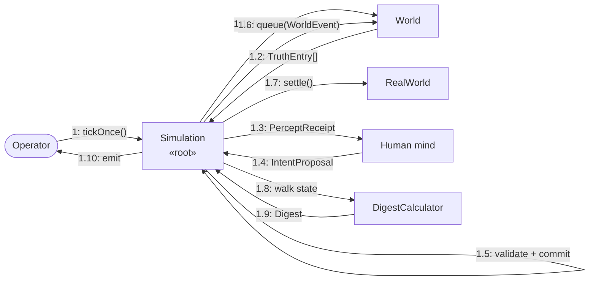
```mermaid
flowchart LR
  OP(["Operator"])
  SIM["Simulation<br/>«root»"]
  W["World"]
  RW["RealWorld"]
  M["Human mind"]
  DC["DigestCalculator"]

  OP -->|"1: tickOnce()"| SIM
  SIM -->|"1.1: freezeTruth()"| W
  W -->|"1.2: TruthEntry[]"| SIM
  SIM -->|"1.3: PerceptReceipt"| M
  M -->|"1.4: IntentProposal"| SIM
  SIM -->|"1.5: validate + commit"| SIM
  SIM -->|"1.6: queue(WorldEvent)"| W
  SIM -->|"1.7: settle()"| RW
  SIM -->|"1.8: walk state"| DC
  DC -->|"1.9: Digest"| SIM
  SIM -->|"1.10: emit"| OP
```

The shape shows the thing the sequence diagram hides: **every arrow to a mind and every
arrow from one passes through `Simulation`.** There is no edge from `World` to `M`, and
none from `M` to `W`. That is the whole boundary, drawn as a topology.

---

## 13 · Interaction overview diagram

> *Approximation.* Mermaid has no interaction-overview renderer. Drawn as a flowchart with
> UML conventions: `ref` frames stand for whole interactions, decision and merge nodes
> control the flow between them.

The run as a whole — each `ref` box is an interaction defined elsewhere in this document.

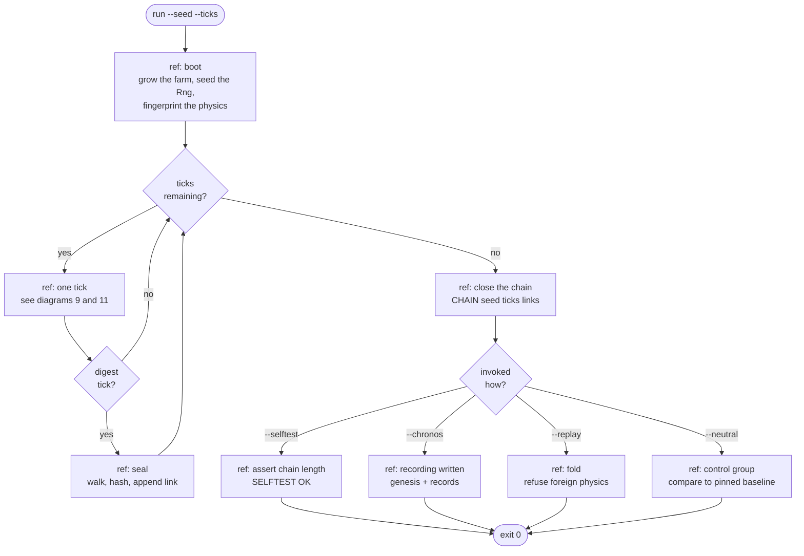
```mermaid
flowchart TB
  START([run --seed --ticks]) --> BOOT["ref: boot<br/>grow the farm, seed the Rng,<br/>fingerprint the physics"]
  BOOT --> LOOPQ{"ticks<br/>remaining?"}
  LOOPQ -->|yes| TICK["ref: one tick<br/>see diagrams 9 and 11"]
  TICK --> SEALQ{"digest<br/>tick?"}
  SEALQ -->|yes| SEAL["ref: seal<br/>walk, hash, append link"]
  SEALQ -->|no| LOOPQ
  SEAL --> LOOPQ
  LOOPQ -->|no| CHAIN["ref: close the chain<br/>CHAIN seed ticks links"]
  CHAIN --> MODE{"invoked<br/>how?"}
  MODE -->|"--selftest"| ST["ref: assert chain length<br/>SELFTEST OK"]
  MODE -->|"--chronos"| REC["ref: recording written<br/>genesis + records"]
  MODE -->|"--replay"| RP["ref: fold<br/>refuse foreign physics"]
  MODE -->|"--neutral"| NE["ref: control group<br/>compare to pinned baseline"]
  ST --> END([exit 0])
  REC --> END
  RP --> END
  NE --> END
```

---

## 14 · Timing diagram

> *Approximation.* Mermaid has no timing-diagram renderer, and this is the weakest of the
> fourteen — a Gantt chart carries duration and ordering but not the state-lifeline
> waveform UML draws. The state changes and their ticks are real; the notation is not.

One pilot's link across a 6,000-tick run at seed 42, and the system state underneath it.

```mermaid
gantt
  title Link and system state — seed 42, 6,000 ticks
  dateFormat X
  axisFormat %s

  section System
  NORMAL              :done, 0, 3316
  NEGOTIATION         :active, 3316, 3356
  PEACE               :done, 3356, 6000

  section The One
  no One yet          :0, 1299
  born, link open     :active, 1299, 4259
  died and closed     :crit, 4259, 4299
  reborn              :active, 4259, 6000

  section Digest chain
  60 links, one per 100 ticks :done, 0, 6000
```

The value in it is one alignment: the negotiation window is forty ticks wide and the rng
stream spends exactly zero draws inside it — the world holding its breath, and the only
figure on this page that a probe now judges rather than merely prints.

---

## Notes on method

- **Extraction, not intent.** Package edges come from `grep '^import matrix\.'`, hierarchies
  from the `extends`/`implements` clauses, composition from field declarations, the CLI from
  the string literals `Main` compares against, enum constants from the enum bodies.
- **Where a diagram is an approximation it says so above itself**, with what is missing named.
  Six of the fourteen are approximations: component, composite structure, deployment, use
  case, communication, interaction overview — plus timing, which is the weakest.
- **Nothing here is a lock.** These diagrams are documentation and go stale the moment the
  code moves; the repository's own answer to that problem is that a figure with a producing
  command gets a `DocFigures` marker. None of these have one, which is a real limitation and
  is stated rather than left to be discovered.
